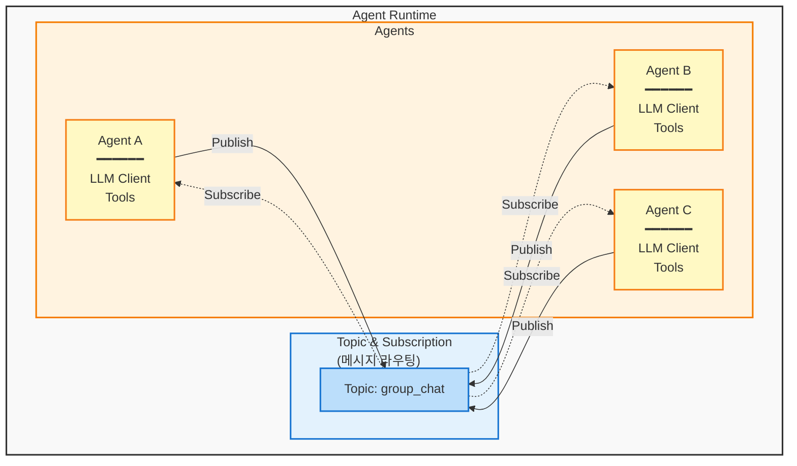
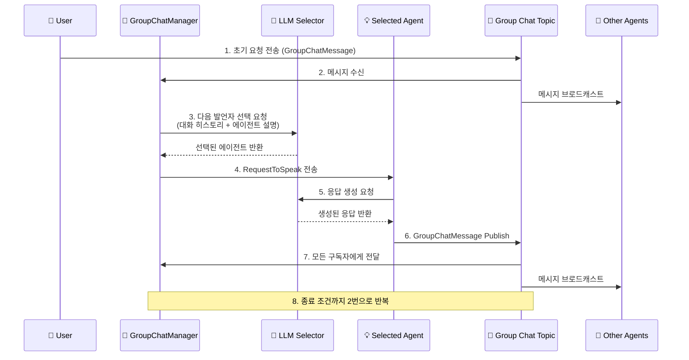
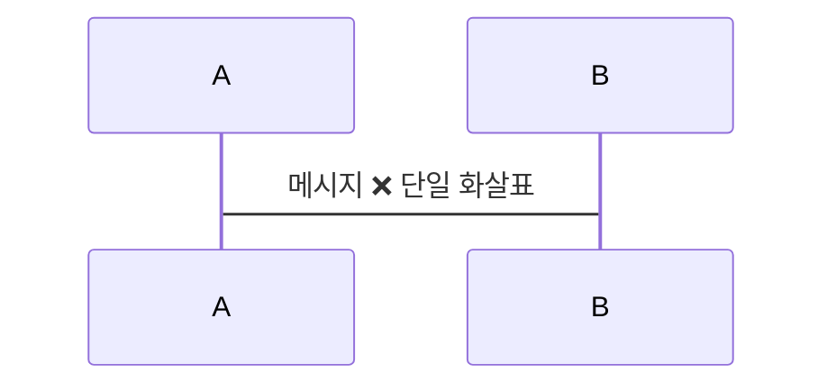
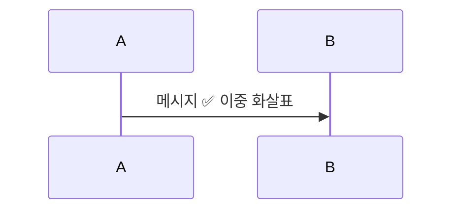

# Mermaid 다이어그램 생성 가이드

## 개요

이 문서는 Docusaurus 문서에서 Mermaid 다이어그램을 파싱 오류 없이 생성하기 위한 가이드입니다. 실제 프로젝트에서 발생한 파싱 에러를 기반으로 작성되었습니다.

## 공통 원칙

### 1. 기본 구조

```markdown
```mermaid
<다이어그램 타입>
    <다이어그램 내용>
```
```

### 2. 지원되는 다이어그램 타입

- `graph TB` / `graph LR` - 플로우차트 (Top to Bottom / Left to Right)
- `sequenceDiagram` - 시퀀스 다이어그램
- `classDiagram` - 클래스 다이어그램
- `stateDiagram-v2` - 상태 다이어그램
- `erDiagram` - ER 다이어그램
- `gantt` - 간트 차트

### 3. 필수 설정 (Docusaurus)

`docusaurus.config.ts`:
```typescript
markdown: {
  format: 'mdx',
  mermaid: true,
},

themes: ['@docusaurus/theme-mermaid'],
```

패키지 설치:
```bash
npm install @docusaurus/theme-mermaid
```

---

## Graph 다이어그램 (플로우차트)

### ✅ 올바른 예제



### 주요 포인트

1. **노드 정의**
   - 사각형: `NodeID[텍스트]`
   - 둥근 사각형: `NodeID(텍스트)`
   - 원형: `NodeID((텍스트))`
   - 마름모: `NodeID{텍스트}`

2. **연결선**
   - 실선 화살표: `-->` 또는 `--텍스트-->`
   - 점선 화살표: `-.->` 또는 `-.텍스트.->`
   - 굵은 실선: `==>`
   - 양방향: `<-->`

3. **줄바꿈**
   - `<br/>` 사용 (HTML 태그)
   - 예: `["Agent A<br/>━━━━━━<br/>LLM Client"]`

4. **subgraph 사용**
   - 그룹화 및 네임스페이스
   - 제목에 따옴표 사용: `subgraph Title["표시 제목"]`

5. **스타일링 (✅ Graph에서만 가능)**
   - `style NodeID fill:#color,stroke:#color,stroke-width:2px`
   - 색상은 HEX 코드 사용
   - fill: 배경색, stroke: 테두리색

---

## Sequence Diagram (시퀀스 다이어그램)

### ✅ 올바른 예제



### ❌ 잘못된 예제 (파싱 에러 발생)

```mermaid
sequenceDiagram
    participant User as User
    participant Manager as GroupChatManager
    
    User->>Manager: 메시지 전송
    
    style User fill:#e1f5ff,stroke:#01579b,stroke-width:2px  ❌ 파싱 에러!
    style Manager fill:#fff9c4,stroke:#f57f17,stroke-width:2px  ❌ 파싱 에러!
```

### 주요 포인트

1. **Participant 정의**
   - `participant ID as 표시이름`
   - **이모지 사용 권장**: 시각적 구분을 위해 participant 이름에 이모지 포함
   - 예: `participant User as 👤 User`

2. **메시지 화살표**
   - 실선: `->>` (동기 호출)
   - 점선: `-->>` (응답)
   - 비동기: `--)` 
   - 메시지 텍스트: `A->>B: 메시지 내용`

3. **줄바꿈**
   - `<br/>` 사용 가능
   - 예: `A->>B: 첫 줄<br/>둘째 줄`

4. **노트 추가**
   - `Note over A,B: 노트 내용`
   - `Note left of A: 왼쪽 노트`
   - `Note right of A: 오른쪽 노트`

5. **⚠️ 중요: Style 명령어 사용 금지**
   - Sequence Diagram에서 `style` 명령어는 **파싱 에러**를 일으킴
   - 대신 **이모지**를 사용하여 시각적 구분
   - 또는 participant 이름에 직접 구분자 포함

---

## 일반적인 파싱 에러 및 해결법

### 1. ❌ Style 명령어 파싱 에러

**에러 메시지:**
```
Parse error on line X: ... style User fill:#e1f5ff,stroke:#015
Expecting 'SOLID_OPEN_ARROW', 'DOTTED_OPEN_ARROW', ... got 'TXT'
```

**원인:**
- Sequence Diagram에서 `style` 명령어 사용

**해결:**
- Graph 다이어그램으로 변경하거나
- Sequence Diagram에서는 이모지 사용

### 2. ❌ 따옴표 불일치

**에러 예:**
```mermaid
graph TB
    Node["텍스트']  ❌ 잘못된 따옴표
```

**해결:**
```mermaid
graph TB
    Node["텍스트"]  ✅ 일치하는 따옴표
```

### 3. ❌ 예약어 충돌

**에러 예:**
```mermaid
graph TB
    end["종료"]  ❌ 'end'는 예약어
```

**해결:**
```mermaid
graph TB
    endNode["종료"]  ✅ 다른 이름 사용
```

### 4. ❌ 잘못된 화살표 구문

**에러 예:**


**해결:**


---

## 베스트 프랙티스

### 1. 색상 팔레트 일관성

Graph 다이어그램용 추천 색상:

```
배경색:
- 연한 회색: #f9f9f9
- 연한 파랑: #e3f2fd
- 연한 주황: #fff3e0
- 연한 노랑: #fff9c4
- 연한 초록: #c8e6c9

테두리색:
- 진한 회색: #333
- 진한 파랑: #1976d2
- 진한 주황: #f57c00
- 진한 노랑: #f57f17
- 진한 초록: #1b5e20
```

### 2. 이모지 팔레트

Sequence Diagram용 추천 이모지:

```
👤 - User/사용자
🎯 - Manager/관리자
🤖 - AI/LLM/봇
💡 - Agent/에이전트
📢 - Topic/브로드캐스트
👥 - Group/그룹
🔧 - Tool/도구
📊 - Data/데이터
🔒 - Security/보안
✅ - Success/성공
❌ - Error/에러
⚠️ - Warning/경고
```

### 3. 가독성 향상

1. **들여쓰기 일관성 유지**
   ```mermaid
   graph TB
       A[시작]
       B[처리]
       C[종료]
       
       A --> B
       B --> C
   ```

2. **복잡한 다이어그램은 섹션 분리**
   - subgraph 활용
   - 논리적 그룹화

3. **명확한 라벨 사용**
   - 간결하면서도 의미 있는 텍스트
   - 필요시 번호 추가 (1., 2., 3.)

### 4. 테스트 방법

1. 로컬 개발 서버에서 먼저 확인
   ```bash
   npm start
   ```

2. 파싱 에러 발생 시 브라우저 콘솔 확인

3. 단계적으로 다이어그램 구축
   - 기본 구조부터 시작
   - 점진적으로 요소 추가
   - 각 단계마다 렌더링 확인

---

## 체크리스트

다이어그램 작성 전 확인사항:

- [ ] Docusaurus 설정 완료 (`mermaid: true`, theme 설치)
- [ ] 올바른 다이어그램 타입 선택
- [ ] Sequence Diagram에서 `style` 명령어 사용하지 않음
- [ ] 따옴표 일치 확인
- [ ] 예약어 충돌 없음
- [ ] 화살표 구문 올바름
- [ ] 이모지 또는 색상으로 시각적 구분
- [ ] 들여쓰기 일관성 유지
- [ ] 로컬에서 렌더링 테스트 완료

---

## 추가 리소스

- [Mermaid 공식 문서](https://mermaid.js.org/)
- [Docusaurus Mermaid 가이드](https://docusaurus.io/docs/markdown-features/diagrams)
- [Mermaid Live Editor](https://mermaid.live/) - 온라인 테스트 도구

---

## 업데이트 이력

- 2026-01-15: 초기 버전 생성 (Sequence Diagram style 에러 기반)
