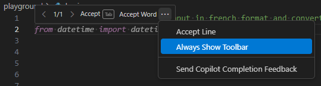
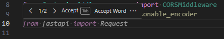
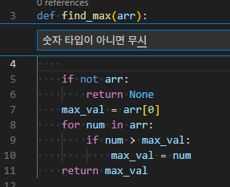

# Github Copilot 개요

*Version 1.0 - 2025년 10월*

## 📘 개요

GitHub Copilot은 **AI 코딩 파트너**로서, 개발자의 생산성을 획기적으로 향상시키는 **Code Completion 도구** 입니다.

## 💡 주요 특징

* **단순 코드 자동완성 이상의 역할**

  Copilot은 소프트웨어 개발 생명주기(SDLC) 전반에 걸쳐 도움을 제공합니다.

  * 코드 에디터 내 실시간 제안 및 채팅 지원
  * github.com 상의 코드 설명 및 문서 검색
  * 보안 취약점 탐지 및 안전한 코딩 가이드 제안

  > 🔗 [관련 문서: Found Means Fixed (GitHub Blog)](https://github.blog/news-insights/product-news/found-means-fixed-introducing-code-scanning-autofix-powered-by-github-copilot-and-codeql/)

* **AI 기반 코드 제안**
  모든 제안은 AI가 실시간으로 생성하며, 특정 저장소에서 데이터를 재 활용 하지 않습니다.

* **다양한 언어 지원**
  Python, Java, C#, 심지어 Cobol 등 여러 언어를 지원합니다.


## ⚙️ 기반 기술

GitHub Copilot은 **OpenAI의 대규모 언어 모델(LLM)** 을 기반으로 작동합니다.

* LLM은 방대한 텍스트 데이터를 학습해 **언어 패턴과 문맥을 이해**하고
  **텍스트 생성, 번역, 질의응답** 등의 작업에 특화되어 있습니다.
* Copilot은 특히 **코드 관련 질의응답**에 집중된 모델입니다.

> 2025년 10월 기준 GPT-5-(Codex) 모델을 사용할 수 있습니다.


<div class="warning" data-title="warning">

> Github Copilot 은 매우 빠르게 [발전](https://github.blog/changelog/label/copilot/)하는 제품이므로, 이 워크숍의 내용이 최신 기능 및 확장과 완전히 일치하지 않을 수 있습니다.
따라서 약간 다르더라도 상황에 맞게 유연하게 이해하고 진행해 주세요
</div>

**Github Copilot 시작하기 - 공식영상**
<div class="video-embed">
  <iframe width="800" height="600" src="https://www.youtube.com/embed/n0NlxUyA7FI" title="Getting started with GitHub Copilot | Tutorial" frameborder="0" allow="accelerometer; autoplay; clipboard-write; encrypted-media; gyroscope; picture-in-picture; web-share" allowfullscreen></iframe>
</div>


Content for first section

---

# 실습 1: Code Completion

## 📝 학습 목표
- GitHub Copilot의 기본 코드 자동완성 기능 익히기
- 인라인 제안(Inline Suggestions) 활용법 학습
- 키보드 단축키를 통한 효율적인 코딩 방법 습득

## 🛠️ 실습 내용

### 1.1 기본 설정
- **활성화/비활성화**: `Ctrl + Shift + P` → "Copilot: Enable/Disable"
- **제안 툴바 활성화**
  

### 1.2 주요 단축키
- `Tab`: 인라인 제안 수락
- `Esc`: 인라인 제안 거부
- `Alt + ]`: 다음 제안 표시
  
- `Alt + [`: 이전 제안 표시
- `Alt + \`: 인라인 제안 트리거
- `Ctrl + I`: 인라인 프롬프트 작성
  


### 1.3 기본 코드 자동완성
```javascript
// 함수명과 주석만 작성하면 Copilot이 구현체를 제안합니다
function calculateTax(price, taxRate) {
  // 세금을 계산하는 함수
  
}
```

### 1.4 반복 패턴 학습
```python
# 몇 개의 예시를 작성하면 패턴을 학습하여 나머지를 자동완성합니다
def get_monday():
    return "Monday"

def get_tuesday():
    return "Tuesday"

# Copilot이 나머지 요일 함수들을 자동으로 제안합니다
```
### 1.5 주석 활용
```javascript
// 배열에서 최대값을 찾는 함수
function findMax(arr) {
  // Copilot이 구현체를 제안합니다
}
```


## ✅ 실습 과제
1. 간단한 계산기 함수 작성 (덧셈, 뺄셈, 곱셈, 나눗셈)
2. 배열 정렬 함수 구현
3. 문자열 처리 유틸리티 함수 작성

---

# Level 2: Use Copilot Chat to improve code quality

## 📝 학습 목표
- GitHub Copilot Chat 기능 활용법 학습
- 코드 리뷰 및 개선 방법 습득
- 테스트 코드 생성 및 문서화 자동화

## 🛠️ 실습 내용

### 2.1 Copilot Chat 시작하기
```
// 채팅창에서 다음과 같이 질문할 수 있습니다:
"이 함수의 성능을 개선할 수 있는 방법이 있나요?"
"이 코드에 대한 단위 테스트를 작성해주세요"
"이 함수의 복잡도를 줄일 수 있나요?"
```

### 2.2 코드 품질 개선
- **코드 리팩토링**: 기존 코드의 구조 개선
- **성능 최적화**: 알고리즘 효율성 향상
- **가독성 향상**: 더 명확하고 이해하기 쉬운 코드로 변경

### 2.3 테스트 코드 생성
```javascript
// 원본 함수
function validateEmail(email) {
  const regex = /^[^\s@]+@[^\s@]+\.[^\s@]+$/;
  return regex.test(email);
}

// Copilot Chat에 "이 함수의 테스트 코드를 작성해주세요"라고 요청
```

### 2.4 문서화 자동생성
- JSDoc, Python docstring 등 자동 생성
- README 파일 작성 도움
- API 문서 생성 지원

## ✅ 실습 과제
1. 기존 코드의 성능 개선안 요청하기
2. 단위 테스트 코드 자동 생성하기
3. 함수 문서화(JSDoc/docstring) 자동 생성하기
4. 코드 리뷰 의견 받기

---

# Level 3: Copilot Edit & Agents Mode

## 📝 학습 목표
- GitHub Copilot Edits 기능 활용법 학습
- 다중 파일 편집 및 프로젝트 구조 개선
- Agents Mode를 통한 전문화된 작업 수행

## 🛠️ 실습 내용

### 3.1 Copilot Edits 기능
- **다중 파일 동시 편집**: 여러 파일을 한 번에 수정
- **프로젝트 범위 리팩토링**: 전체 프로젝트 구조 개선
- **일관된 스타일 적용**: 코딩 컨벤션 자동 적용

```
// Copilot Edits 명령 예시:
"모든 JavaScript 파일에서 var를 const/let으로 변경해주세요"
"프로젝트 전체에서 함수명을 camelCase로 통일해주세요"
"모든 컴포넌트에 TypeScript 타입을 추가해주세요"
```

### 3.2 Agents Mode 활용
GitHub Copilot의 전문화된 에이전트들을 활용하여 특정 작업을 효율적으로 수행합니다.

#### @workspace Agent
```
@workspace 이 프로젝트의 전체 구조를 분석해주세요
@workspace 프로젝트에서 사용하지 않는 종속성을 찾아주세요
```

#### @vscode Agent
```
@vscode 이 프로젝트에 적합한 확장 프로그램을 추천해주세요
@vscode 디버깅 설정을 도와주세요
```

#### @terminal Agent
```
@terminal npm 패키지를 설치하고 프로젝트를 실행해주세요
@terminal 테스트를 실행하고 결과를 분석해주세요
```

### 3.3 고급 편집 기능
- **컨텍스트 인식 편집**: 프로젝트 전체 맥락을 고려한 수정
- **패턴 기반 변경**: 반복되는 패턴을 자동으로 감지하여 적용
- **의존성 관리**: 코드 변경 시 관련 파일들도 함께 업데이트

## ✅ 실습 과제
1. 전체 프로젝트에서 ES6+ 문법으로 업그레이드하기
2. @workspace 에이전트로 프로젝트 구조 분석하기
3. 여러 파일에 걸친 함수 리팩토링 수행하기
4. @terminal 에이전트로 자동화된 빌드/테스트 파이프라인 구성하기

---

# Level 4: Copilot Advanced

## 📝 학습 목표
- GitHub Copilot의 고급 기능 및 최적화 방법 학습
- 팀 협업을 위한 Copilot 활용 전략 수립
- 프로덕션 환경에서의 보안 및 품질 관리

## 🛠️ 실습 내용

### 4.1 고급 프롬프트 엔지니어링
효과적인 프롬프트 작성을 통해 더 정확하고 유용한 결과를 얻습니다.

```javascript
/**
 * 고급 프롬프트 예시:
 * 
 * 컨텍스트: Node.js Express 애플리케이션
 * 요구사항: RESTful API 엔드포인트 작성
 * 제약조건: TypeScript, JWT 인증, 에러 핸들링 포함
 * 스타일: Clean Architecture 패턴 적용
 */

// 이러한 상세한 컨텍스트를 제공하면 더 정확한 코드를 생성합니다
```

### 4.2 커스텀 Instructions 설정
프로젝트별 또는 팀별 코딩 스타일과 규칙을 Copilot에 학습시킵니다.

```json
{
  "copilot.instructions": {
    "codeStyle": "Google JavaScript Style Guide",
    "testing": "Jest framework preferred",
    "documentation": "JSDoc required for all public functions",
    "security": "Always validate user inputs"
  }
}
```

### 4.3 Copilot for Business/Enterprise 기능
- **코드 보안 스캔**: 취약점 자동 탐지 및 수정 제안
- **라이선스 준수**: 오픈소스 라이선스 충돌 방지
- **감사 로그**: 코드 생성 이력 추적
- **정책 관리**: 조직별 사용 정책 설정

### 4.4 성능 모니터링 및 최적화
```javascript
// Copilot 사용 통계 분석
const copilotMetrics = {
  acceptanceRate: 85,      // 제안 수락률
  timesSaved: 120,         // 절약된 시간 (분)
  linesGenerated: 2450,    // 생성된 코드 라인 수
  errorsReduced: 23        // 줄어든 버그 수
};
```

### 4.5 팀 협업 최적화
- **공통 패턴 공유**: 팀의 코딩 패턴을 Copilot에 학습
- **코드 리뷰 통합**: Pull Request에서 Copilot 활용
- **지식 베이스 구축**: 프로젝트별 베스트 프랙티스 문서화

### 4.6 CI/CD 파이프라인 통합
```yaml
# .github/workflows/copilot-security.yml
name: Copilot Security Scan
on: [push, pull_request]
jobs:
  security-scan:
    runs-on: ubuntu-latest
    steps:
      - uses: actions/checkout@v3
      - name: GitHub Copilot Security Scan
        uses: github/copilot-security-action@v1
```

## ✅ 실습 과제
1. 프로젝트별 커스텀 Instructions 설정하기
2. Copilot을 활용한 보안 코드 리뷰 수행하기
3. 팀 코딩 스타일 가이드 자동화하기
4. CI/CD 파이프라인에 Copilot 보안 스캔 통합하기
5. Copilot 사용 성과 측정 및 분석하기

## 🎯 고급 활용 팁
- **컨텍스트 최적화**: 관련 파일들을 함께 열어 더 나은 제안 받기
- **단계별 접근**: 복잡한 문제를 작은 단위로 나누어 해결하기
- **피드백 루프**: 생성된 코드를 검토하고 개선 사항 반영하기
- **보안 의식**: 생성된 코드의 보안 취약점 항상 검증하기

---


# Lab: Copilot 코딩 에이전트를 개발팀원으로 활용

GitHub Copilot을 활용한 단계별 실습을 통해 AI 코딩 파트너의 진정한 가치를 경험해보세요.

---

# 🎓 워크숍 마무리

이 4단계 워크숍을 통해 GitHub Copilot의 기본 기능부터 고급 활용법까지 체계적으로 학습했습니다. 

## 주요 성과
- ✅ 코드 자동완성으로 개발 속도 향상
- ✅ Chat 기능으로 코드 품질 개선
- ✅ Edits & Agents로 프로젝트 단위 작업 효율화
- ✅ 고급 기능으로 팀 협업 및 보안 강화

## 다음 단계
1. 실제 프로젝트에 Copilot 적용해보기
2. 팀원들과 베스트 프랙티스 공유하기
3. 지속적인 학습으로 새로운 기능 활용하기

**Happy Coding with GitHub Copilot! 🚀**


