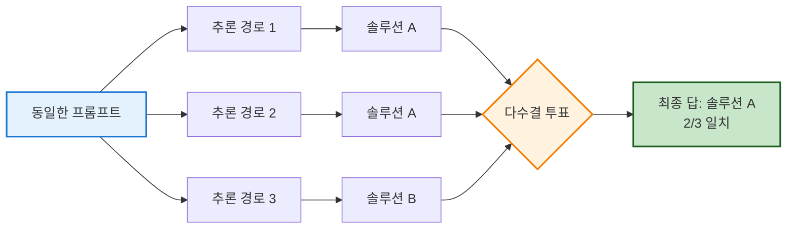

# 프롬프트 엔지니어링 이해

## 프롬프트 엔지니어링이란?

프롬프트 엔지니어링은 대규모 언어 모델(LLM)로부터 원하는 결과를 얻기 위해 효과적인 입력(프롬프트)을 설계하고 최적화하는 기술입니다. 이는 AI 모델의 성능을 최대화하고 더 나은 결과를 얻기 위한 핵심 스킬입니다.

### 프롬프트 엔지니어링의 본질

좋은 질문이 정확한 답변을 이끌어내듯이, **전략적으로 작성된 프롬프트**는 GitHub Copilot이 더욱 관련성 높고 정확한 코드를 생성하도록 안내합니다. 이는 단순히 "무엇을 만들어줘"라고 요청하는 것을 넘어, AI가 정확히 어떤 결과물을 만들어야 하는지 명확하게 이해할 수 있도록 입력을 구성하는 것입니다.

:::tip 비유로 이해하기
프롬프트 엔지니어링은 **레스토랑에서 요리를 주문하는 것**과 비슷합니다:

- ❌ "뭐 좀 만들어줘" → 예상치 못한 결과
- ⚠️ "파스타 만들어줘" → 기본적인 결과
- ✅ "토마토 베이스의 알리오올리오 파스타를, 마늘은 많이, 페페론치노는 적당히 넣어주세요. 면은 알덴테로 부탁드립니다." → 정확히 원하는 결과
:::

### 핵심 기법

프롬프트 엔지니어링은 다음과 같은 기법들을 포함합니다:

1. **역할 부여 (Role Prompting)**
   ```
   "당신은 시니어 백엔드 개발자입니다. REST API 설계 베스트 프랙티스를 따라..."
   ```

2. **상세한 컨텍스트 제공 (Contextual Detailing)**
   ```
   "이 프로젝트는 FastAPI를 사용하며, 이미 JWT 인증이 구현되어 있습니다. 
   같은 패턴을 따라 새로운 엔드포인트를..."
   ```

3. **반복적 개선 (Iterative Refinement)**
   ```
   첫 번째 시도 → 결과 확인 → 프롬프트 조정 → 더 나은 결과
   ```

### 언제 프롬프트 엔지니어링이 필요한가?

#### 🟢 일회성 작업 (간단한 프롬프트로 충분)
```python
# "리스트의 합계를 구하는 함수" ← 이 정도로 충분
def sum_list(numbers):
    return sum(numbers)
```

#### 🟡 프로덕션 코드 (프롬프트 엔지니어링 필요)

프로덕션 환경에서는 다음이 중요합니다:

- **신뢰성**: 매번 일관된 품질의 코드 생성
- **예측 가능성**: 응답 형식과 구조를 예측할 수 있어야 함
- **유지보수성**: 팀 전체가 이해하고 사용할 수 있는 코드

**예시:**
```python
# ❌ 일회성 프롬프트
# 사용자 데이터 저장

# ✅ 프로덕션용 프롬프트 (프롬프트 엔지니어링 적용)
# 다음 요구사항에 따라 사용자 데이터를 안전하게 저장하는 함수를 작성하세요:
# 1. 입력 검증: 이메일 형식, 비밀번호 강도 확인
# 2. 보안: bcrypt로 비밀번호 해싱 (salt rounds: 12)
# 3. 에러 처리: 명확한 예외 메시지와 로깅
# 4. 타입 힌트: 모든 파라미터와 리턴 타입 명시
# 5. 문서화: docstring에 예시 포함
# 6. 트랜잭션: 실패 시 롤백 보장
```

### 프롬프트 엔지니어링의 가치

개발자가 프롬프트 엔지니어링을 깊이 이해하면:

- ⚡ **생산성 향상**: 첫 시도에 원하는 코드 획득
- 🎯 **정확도 증가**: 요구사항에 정확히 맞는 코드 생성
- 🔄 **일관성 유지**: 프로젝트 전반에 걸쳐 일관된 코드 스타일
- 🚀 **Copilot 활용 극대화**: 고급 AI 코딩 어시스턴트의 진정한 잠재력 발휘

:::info 핵심 정리
프롬프트 엔지니어링은 **AI와 대화하는 기술**입니다. 단순히 명령하는 것이 아니라, AI가 당신의 의도를 정확히 이해하고 최상의 결과를 생성할 수 있도록 전략적으로 소통하는 것입니다.
:::

## 왜 중요한가?

### 1. 정확성 향상
- 명확한 프롬프트 → 정확한 코드
- 모호한 요청 → 예상치 못한 결과
- 올바른 프롬프트 기법으로 작업 성공률 대폭 향상

### 2. 생산성 증대
- 첫 시도에서 원하는 결과 획득
- 반복 수정 시간 감소
- 복잡한 작업을 효과적으로 처리

### 3. 코드 품질 개선
- 베스트 프랙티스 적용 요청 가능
- 특정 패턴이나 스타일 지정 가능
- 더 신뢰할 수 있는 결과 생성

## 기본 원칙

### 명확성 (Clarity)
```javascript title="명확한 주석 예시"
// ❌ 나쁨 예: 모호한 주석
// 함수 만들기

// ✅ 좋은 예: 명확한 주석
// 두 숫자를 입력받아 합계를 반환하는 함수를 작성
function add(a, b) {
    return a + b;
}
```

### 구체성 (Specificity)
```python title="구체적인 요청 예시"
# ❌ 나쁨 예: 일반적인 요청
# 데이터 처리

# ✅ 좋은 예: 구체적인 요청
# CSV 파일에서 데이터를 읽어 판다스 DataFrame으로 변환하고,
# 'age' 컬럼의 평균값을 계산하는 함수
```

### 컨텍스트 제공
```python
# 기존 코드와 함께 사용될 컨텍스트 제공
from typing import TypedDict

class User(TypedDict):
    id: int
    name: str
    email: str

# User 리스트에서 특정 이메일을 가진 사용자를 찾는 함수
def find_user_by_email(users: list[User], email: str) -> User | None:
    return next((user for user in users if user['email'] == email), None)
```

## 주요 프롬프트 기법

### 1. Zero-shot Prompting (제로샷 프롬프팅)

Zero-shot 프롬프팅은 모델에게 예시를 제공하지 않고 직접 작업을 지시하는 방법입니다. GitHub Copilot은 명확한 요구사항만으로도 코드를 생성할 수 있습니다.

**예시:**
```python
# CSV 파일을 읽어서 데이터를 정렬하고 필터링하는 함수를 작성해주세요
# - pandas를 사용합니다
# - age가 30 이상인 데이터만 필터링합니다
# - name 컬럼 기준으로 오름차순 정렬합니다
```

**Copilot이 생성하는 코드:**
```python
import pandas as pd

def process_csv_data(file_path: str) -> pd.DataFrame:
    """
    CSV 파일을 읽어 필터링 및 정렬을 수행합니다.
    
    Args:
        file_path: CSV 파일 경로
        
    Returns:
        처리된 DataFrame
    """
    df = pd.read_csv(file_path)
    filtered_df = df[df['age'] >= 30]
    sorted_df = filtered_df.sort_values('name', ascending=True)
    return sorted_df
```

**장점:**
- 간단하고 빠른 적용
- 예시 준비 불필요
- 다양한 작업에 즉시 활용 가능

**한계:**
- 복잡한 추론 작업에는 부족할 수 있음
- 특정 포맷이나 스타일 요구 시 불안정

### 2. Few-shot Prompting (퓨샷 프롬프팅)

Few-shot 프롬프팅은 모델에게 몇 가지 예시를 제공하여 원하는 패턴을 학습시키는 방법입니다. GitHub Copilot에서 특정 코드 스타일이나 패턴을 따르게 할 때 효과적입니다.

:::tip 실전 팁 
- 특정 코드 예시를 chat 에 추가해도 되지만 특정 파일을 지정하여 그 파일의 함수 이름을 예시로 사용가능
:::

**예시:**
```python
# 다음 패턴을 따라 새로운 API 엔드포인트를 작성해주세요

# 예시 1: 사용자 조회
@app.get("/api/users/{user_id}")
async def get_user(user_id: str, db: Session = Depends(get_db)):
    user = db.query(User).filter(User.id == user_id).first()
    if not user:
        raise HTTPException(status_code=404, detail="User not found")
    return user

# 예시 2: 게시글 조회
@app.get("/api/posts/{post_id}")
async def get_post(post_id: str, db: Session = Depends(get_db)):
    post = db.query(Post).filter(Post.id == post_id).first()
    if not post:
        raise HTTPException(status_code=404, detail="Post not found")
    return post

# 이제 댓글 조회 엔드포인트를 같은 패턴으로 작성해주세요
```

**Copilot이 생성하는 코드:**
```python
@app.get("/api/comments/{comment_id}")
async def get_comment(comment_id: str, db: Session = Depends(get_db)):
    comment = db.query(Comment).filter(Comment.id == comment_id).first()
    if not comment:
        raise HTTPException(status_code=404, detail="Comment not found")
    return comment
```

**효과적인 Few-shot 팁:**
- 라벨 공간과 입력 텍스트 분포가 중요 (개별 라벨의 정확성보다)
- 포맷이 매우 중요함
- 랜덤 라벨이라도 라벨이 없는 것보다 나음
- 실제 라벨 분포에서 샘플링하는 것이 더 효과적

**한계:**
- 복잡한 추론 작업에는 여전히 부족할 수 있음
- 예시 작성에 시간 소요
- 긴 프롬프트로 인한 토큰 비용 증가

### 3. Chain-of-Thought Prompting (사고 과정 프롬프팅)

Chain-of-Thought (CoT) 프롬프팅은 모델이 중간 추론 단계를 거쳐 복잡한 문제를 해결하도록 유도하는 기법입니다. 코드 작성 시 구현 로직을 단계별로 설명하면 더 정확한 코드를 얻을 수 있습니다.

:::tip 실전 팁 
- vscode 에서는 Plan 으로 계획을 리뷰하여 프롬프트를 조정할 수 있습니다.
:::

**표준 프롬프팅 vs CoT 프롬프팅 비교:**

**❌ 표준 프롬프팅 (모호함):**
```python
# 사용자 등록 함수를 작성해주세요
```

**✅ CoT 프롬프팅 (단계별 설명):**
```python
# 사용자 등록 함수를 다음 단계로 구현해주세요:
# 1. 이메일 형식이 유효한지 검증합니다
# 2. 비밀번호 강도를 확인합니다 (최소 8자, 대소문자, 숫자, 특수문자 포함)
# 3. 이메일 중복 여부를 데이터베이스에서 확인합니다
# 4. 비밀번호를 bcrypt로 해싱합니다
# 5. 새 사용자를 데이터베이스에 저장합니다
# 6. 환영 이메일을 발송합니다
# 7. 생성된 사용자 객체를 반환합니다
```

**Copilot이 생성하는 코드:**
```python
import re
import bcrypt
from typing import Optional
from sqlalchemy.orm import Session
from email_validator import validate_email, EmailNotValidError

class UserRegistrationError(Exception):
    pass

def register_user(email: str, password: str, db: Session) -> User:
    """
    새로운 사용자를 등록합니다.
    """
    # 1. 이메일 형식 검증
    try:
        validate_email(email)
    except EmailNotValidError:
        raise UserRegistrationError("유효하지 않은 이메일 형식입니다")
    
    # 2. 비밀번호 강도 확인
    if len(password) < 8:
        raise UserRegistrationError("비밀번호는 최소 8자 이상이어야 합니다")
    if not re.search(r'[A-Z]', password):
        raise UserRegistrationError("비밀번호에 대문자가 포함되어야 합니다")
    if not re.search(r'[a-z]', password):
        raise UserRegistrationError("비밀번호에 소문자가 포함되어야 합니다")
    if not re.search(r'[0-9]', password):
        raise UserRegistrationError("비밀번호에 숫자가 포함되어야 합니다")
    if not re.search(r'[!@#$%^&*]', password):
        raise UserRegistrationError("비밀번호에 특수문자가 포함되어야 합니다")
    
    # 3. 이메일 중복 확인
    existing_user = db.query(User).filter(User.email == email).first()
    if existing_user:
        raise UserRegistrationError("이미 등록된 이메일입니다")
    
    # 4. 비밀번호 해싱
    salt = bcrypt.gensalt()
    hashed_password = bcrypt.hashpw(password.encode('utf-8'), salt)
    
    # 5. 사용자 저장
    new_user = User(
        email=email,
        password_hash=hashed_password.decode('utf-8'),
        is_active=True
    )
    db.add(new_user)
    db.commit()
    db.refresh(new_user)
    
    # 6. 환영 이메일 발송
    send_welcome_email(email)
    
    # 7. 사용자 반환
    return new_user
```

**장점:**
- 복잡한 추론 작업에서 획기적인 성능 향상
- 모델의 사고 과정을 추적 가능
- 신뢰성과 해석 가능성 향상

### 4. Zero-shot CoT ✨

Zero-shot CoT는 단순히 "**단계별로 생각해봅시다**" 또는 "**단계별로 구현해주세요**"라는 문구를 추가하는 것만으로 모델이 체계적인 접근을 하도록 유도합니다.

**예시:**
```python
# 다음 함수의 버그를 찾아 수정해주세요
# 단계별로 분석하고 설명해주세요

def calculate_discount(price, discount_percent):
    discount = price * discount_percent
    final_price = price - discount
    return final_price

# 문제: calculate_discount(100, 20)을 호출하면 -1900이 반환됩니다
```

**Copilot의 단계별 분석 및 수정:**
```python
# 단계별 분석:
# 1. 현재 코드: discount = price * discount_percent
#    - 100 * 20 = 2000이 계산됩니다
# 2. final_price = 100 - 2000 = -1900 (잘못된 결과)
# 3. 문제: discount_percent를 퍼센트가 아닌 정수로 계산함
# 4. 해결: discount_percent를 100으로 나눠서 비율로 변환해야 함

def calculate_discount(price: float, discount_percent: float) -> float:
    """
    가격에 할인율을 적용합니다.
    
    Args:
        price: 원래 가격
        discount_percent: 할인율 (예: 20은 20%를 의미)
        
    Returns:
        할인이 적용된 최종 가격
        
    Examples:
        >>> calculate_discount(100, 20)
        80.0
        >>> calculate_discount(150, 10)
        135.0
    """
    # 1. 할인율을 소수로 변환 (20% -> 0.2)
    discount_rate = discount_percent / 100
    
    # 2. 할인 금액 계산
    discount_amount = price * discount_rate
    
    # 3. 최종 가격 계산
    final_price = price - discount_amount
    
    return final_price
```

**적용 시점:**
- 예시를 만들 시간이 없을 때
- 복잡한 추론이 필요한 작업
- 빠른 프로토타이핑

### 5. Self-Consistency (자기 일관성)

Self-Consistency는 같은 문제에 대해 여러 개의 추론 경로를 생성하고, 가장 일관성 있고 빈도가 높은 답변을 선택하는 방법입니다. CoT와 결합하면 더욱 강력합니다.

#### 핵심 아이디어

단일 답변에 의존하지 않고, 여러 번의 시도를 통해 **가장 신뢰할 수 있는 해결책**을 찾습니다.



#### 실전 예시: 알고리즘 선택

**문제:** "배열에서 중복된 요소를 효율적으로 제거하는 함수를 작성하세요"

**프롬프트 (3번 실행):**
```python
# 배열에서 중복 요소를 제거하는 가장 효율적인 방법을 단계별로 설명하고 구현하세요.
# 시간 복잡도와 공간 복잡도를 고려하세요.
```

**결과 1번 (Set 활용):**
```python
def remove_duplicates_v1(arr: list) -> list:
    """
    접근: Set 자료구조 활용
    시간 복잡도: O(n)
    공간 복잡도: O(n)
    
    Set은 중복을 자동으로 제거하므로 가장 간단하고 효율적입니다.
    """
    return list(set(arr))

# 테스트
# Input: [1, 2, 2, 3, 4, 4, 5]
# Output: [1, 2, 3, 4, 5] (순서 보장 안 됨)
```

**결과 2번 (Dict.fromkeys() - 순서 유지):**
```python
def remove_duplicates_v2(arr: list) -> list:
    """
    접근: dict.fromkeys() 활용
    시간 복잡도: O(n)
    공간 복잡도: O(n)
    
    Python 3.7+에서 dict는 삽입 순서를 보장하므로
    원래 순서를 유지하면서 중복을 제거할 수 있습니다.
    """
    return list(dict.fromkeys(arr))

# 테스트
# Input: [1, 2, 2, 3, 4, 4, 5]
# Output: [1, 2, 3, 4, 5] (순서 유지)
```

**결과 3번 (Dict.fromkeys() - 동일):**
```python
def remove_duplicates_v3(arr: list) -> list:
    """
    접근: dict.fromkeys() 활용
    시간 복잡도: O(n)
    공간 복잡도: O(n)
    
    삽입 순서를 보장하는 dict를 사용하여
    원본 배열의 순서를 유지합니다.
    """
    return list(dict.fromkeys(arr))

# 테스트
# Input: [1, 2, 2, 3, 4, 4, 5]
# Output: [1, 2, 3, 4, 5] (순서 유지)
```

**Self-Consistency 분석:**

| 솔루션 | 빈도 | 순서 유지 | 시간 복잡도 | 공간 복잡도 |
|--------|------|-----------|-------------|-------------|
| Set | 1/3 | ❌ | O(n) | O(n) |
| dict.fromkeys() | 2/3 | ✅ | O(n) | O(n) |

**최종 선택: dict.fromkeys()** 
- 2/3 일치로 가장 일관성 있음
- 순서 보장이라는 추가 이점
- 동일한 성능 특성

#### 복잡한 문제에서의 Self-Consistency

**문제:** "재고 관리 시스템 설계"

**프롬프트 (여러 번 실행):**
```python
# 다음 요구사항을 만족하는 재고 관리 시스템을 설계하세요:
# 1. 재고 추가/감소
# 2. 재고 부족 알림
# 3. 동시성 처리
# 4. 재고 히스토리 추적
#
# 단계별로 접근 방법을 설명하고 핵심 클래스를 구현하세요.
```

**결과 비교:**

| 시도 | 설계 패턴 | 동시성 처리 | 데이터 저장 | 일관성 |
|------|-----------|-------------|-------------|--------|
| 1 | Observer 패턴 | threading.Lock | SQLite | ✅ |
| 2 | Event-driven | asyncio.Lock | PostgreSQL | ✅ |
| 3 | Observer 패턴 | threading.Lock | PostgreSQL | ✅ |

**공통 패턴 추출:**
- ✅ Observer 패턴 (2/3) → 재고 변경 알림에 적합
- ✅ Lock 기반 동시성 (3/3) → 데이터 무결성 보장
- ✅ 관계형 DB (2/3) → 트랜잭션 및 히스토리 추적

**최종 구현 (일관성 기반):**
```python
from abc import ABC, abstractmethod
from typing import List, Optional
import threading
from datetime import datetime
from dataclasses import dataclass

# Observer 패턴 구현
class InventoryObserver(ABC):
    @abstractmethod
    def update(self, item_id: str, quantity: int, threshold: int) -> None:
        """재고 변경 알림"""
        pass

class LowStockAlert(InventoryObserver):
    def update(self, item_id: str, quantity: int, threshold: int) -> None:
        if quantity < threshold:
            print(f"⚠️ 재고 부족 알림: {item_id} - 남은 수량: {quantity}")

@dataclass
class InventoryHistory:
    timestamp: datetime
    item_id: str
    action: str  # 'add' or 'remove'
    quantity: int
    remaining: int

class InventoryManager:
    """
    Self-Consistency로 선택된 최적 설계:
    - Observer 패턴으로 알림 처리
    - threading.Lock으로 동시성 보장
    - PostgreSQL로 영구 저장 (여기서는 메모리로 시뮬레이션)
    """
    
    def __init__(self):
        self._inventory: dict[str, int] = {}
        self._thresholds: dict[str, int] = {}
        self._observers: List[InventoryObserver] = []
        self._history: List[InventoryHistory] = []
        self._lock = threading.Lock()
    
    def attach_observer(self, observer: InventoryObserver) -> None:
        """옵저버 등록"""
        self._observers.append(observer)
    
    def add_item(self, item_id: str, quantity: int, threshold: int = 10) -> None:
        """재고 추가 (동시성 안전)"""
        with self._lock:
            current = self._inventory.get(item_id, 0)
            self._inventory[item_id] = current + quantity
            self._thresholds[item_id] = threshold
            
            # 히스토리 기록
            self._history.append(InventoryHistory(
                timestamp=datetime.now(),
                item_id=item_id,
                action='add',
                quantity=quantity,
                remaining=self._inventory[item_id]
            ))
            
            # 옵저버 알림
            self._notify_observers(item_id)
    
    def remove_item(self, item_id: str, quantity: int) -> bool:
        """재고 감소 (동시성 안전)"""
        with self._lock:
            current = self._inventory.get(item_id, 0)
            
            if current < quantity:
                print(f"❌ 재고 부족: {item_id} (요청: {quantity}, 보유: {current})")
                return False
            
            self._inventory[item_id] = current - quantity
            
            # 히스토리 기록
            self._history.append(InventoryHistory(
                timestamp=datetime.now(),
                item_id=item_id,
                action='remove',
                quantity=quantity,
                remaining=self._inventory[item_id]
            ))
            
            # 옵저버 알림
            self._notify_observers(item_id)
            return True
    
    def _notify_observers(self, item_id: str) -> None:
        """모든 옵저버에게 알림"""
        quantity = self._inventory[item_id]
        threshold = self._thresholds.get(item_id, 0)
        
        for observer in self._observers:
            observer.update(item_id, quantity, threshold)
    
    def get_history(self, item_id: str) -> List[InventoryHistory]:
        """재고 히스토리 조회"""
        return [h for h in self._history if h.item_id == item_id]

# 사용 예시
manager = InventoryManager()
alert = LowStockAlert()
manager.attach_observer(alert)

manager.add_item("ITEM-001", 50, threshold=10)
manager.remove_item("ITEM-001", 45)  # ⚠️ 재고 부족 알림 발생
```

#### Self-Consistency의 장점

**1. 신뢰성 향상**
- 단일 시도의 오류나 편향 감소
- 여러 추론 경로의 합의로 더 안정적인 결과

**2. 최적 솔루션 발견**
- 다양한 접근 방법 탐색
- 공통 패턴에서 베스트 프랙티스 추출

**3. 설계 검증**
- 일관성 있는 패턴 = 좋은 설계일 가능성 높음
- 불일치 = 추가 고려사항 발견

#### 실무 적용 팁

```text
1. 중요한 의사결정이 필요한 경우:
   - 아키텍처 선택
   - 알고리즘 설계
   - 디자인 패턴 적용

2. 프롬프트 작성:
   - 동일한 프롬프트 3-5번 실행
   - 온도(temperature) 설정 조정으로 다양성 확보

3. 결과 분석:
   - 공통 요소 추출
   - 빈도 기반 선택
   - 장단점 비교표 작성

4. 최종 결정:
   - 다수결 + 품질 검증
   - 일관되지 않은 부분은 추가 조사
```

:::warning 주의사항
- Self-Consistency는 시간과 비용(API 호출)이 증가합니다. **중요한 의사결정**에만 사용하고, 간단한 작업에는 일반 프롬프팅으로 충분합니다.
- 일부 모델(Claude Sonnet 등)은 Self-Consistency를 기본적으로 지원하므로, 특정 시점에 자동으로 Self-Consistency 가 수행됩니다.
:::

### 6. Generated Knowledge Prompting (지식 생성 프롬프팅)

코드를 작성하기 전에 관련 베스트 프랙티스나 설계 패턴을 먼저 생성하도록 요청하는 방법입니다.

**예시:**
```python
# 먼저 Python에서 API 에러 처리의 베스트 프랙티스를 설명하고,
# 그 원칙에 따라 REST API 클라이언트 클래스를 구현해주세요
#
# 고려사항:
# - 재시도 로직
# - 타임아웃 처리
# - 적절한 예외 계층 구조
# - 로깅
```

**Copilot의 응답:**
```python
"""
API 에러 처리 베스트 프랙티스:
1. 명확한 예외 계층 구조 정의
2. 재시도 가능한 에러와 불가능한 에러 구분
3. 지수 백오프로 재시도 구현
4. 적절한 타임아웃 설정
5. 구조화된 로깅
"""

import requests
import time
import logging
from typing import Optional, Dict, Any
from requests.adapters import HTTPAdapter
from urllib3.util.retry import Retry

logger = logging.getLogger(__name__)

# 예외 계층 구조
class APIError(Exception):
    """API 호출 기본 예외"""
    pass

class APIConnectionError(APIError):
    """연결 실패"""
    pass

class APITimeoutError(APIError):
    """타임아웃"""
    pass

class APIResponseError(APIError):
    """잘못된 응답"""
    def __init__(self, status_code: int, message: str):
        self.status_code = status_code
        super().__init__(f"HTTP {status_code}: {message}")

class APIClient:
    def __init__(self, base_url: str, timeout: int = 30):
        self.base_url = base_url
        self.timeout = timeout
        self.session = self._create_session()
    
    def _create_session(self) -> requests.Session:
        """재시도 로직이 포함된 세션 생성"""
        session = requests.Session()
        
        # 재시도 전략 설정
        retry_strategy = Retry(
            total=3,
            backoff_factor=1,  # 1, 2, 4초로 지수 증가
            status_forcelist=[429, 500, 502, 503, 504],
            allowed_methods=["GET", "POST", "PUT", "DELETE"]
        )
        
        adapter = HTTPAdapter(max_retries=retry_strategy)
        session.mount("http://", adapter)
        session.mount("https://", adapter)
        
        return session
    
    def request(
        self,
        method: str,
        endpoint: str,
        **kwargs
    ) -> Dict[str, Any]:
        """
        API 요청 실행
        """
        url = f"{self.base_url}/{endpoint.lstrip('/')}"
        
        try:
            logger.info(f"{method} {url}")
            
            response = self.session.request(
                method=method,
                url=url,
                timeout=self.timeout,
                **kwargs
            )
            
            # HTTP 에러 확인
            if response.status_code >= 400:
                logger.error(
                    f"API error: {response.status_code} - {response.text}"
                )
                raise APIResponseError(
                    response.status_code,
                    response.text
                )
            
            logger.info(f"Success: {response.status_code}")
            return response.json()
            
        except requests.exceptions.Timeout as e:
            logger.error(f"Timeout: {e}")
            raise APITimeoutError(f"Request timed out: {e}")
            
        except requests.exceptions.ConnectionError as e:
            logger.error(f"Connection error: {e}")
            raise APIConnectionError(f"Connection failed: {e}")
            
        except requests.exceptions.RequestException as e:
            logger.error(f"Request failed: {e}")
            raise APIError(f"Request failed: {e}")
```

## GitHub Copilot에서의 실전 활용

### 코드 생성 시 효과적인 프롬프팅

```python
# ❌ 비효과적인 프롬프트
# 데이터베이스 함수

# ✅ 효과적인 프롬프트 (CoT 적용)
# 사용자 인증을 처리하는 함수를 작성합니다.
# 1. 이메일과 비밀번호를 입력받습니다
# 2. 비밀번호를 해싱합니다 (bcrypt 사용)
# 3. 데이터베이스에서 사용자를 조회합니다
# 4. 비밀번호가 일치하면 JWT 토큰을 반환합니다
# 5. 실패 시 적절한 에러를 발생시킵니다
```

### Copilot Chat에서 Few-shot 활용

```text
다음과 같은 스타일로 테스트 코드를 작성해주세요:

[예시 1]
def test_user_creation():
    user = create_user("test@example.com", "password123")
    assert user.email == "test@example.com"
    assert user.is_active == True

[예시 2]
def test_user_update():
    user = create_user("test@example.com", "password123")
    update_user(user.id, name="John Doe")
    assert user.name == "John Doe"

이제 delete_user 함수에 대한 테스트를 작성해주세요.
```

### 복잡한 리팩토링에 CoT 적용

```text
다음 코드를 SOLID 원칙에 맞게 리팩토링해주세요.

단계별 접근:
1. 단일 책임 원칙 위반 사항 파악
2. 각 책임을 별도 클래스로 분리
3. 의존성 주입 패턴 적용
4. 인터페이스 추출
5. 최종 리팩토링된 코드 제공

[현재 코드]
```

## 프롬프팅 모범 사례

### 1. 명령어를 명확하게 작성
```text
❌ "코드 좀 작성해줘"
✅ "Python으로 CSV 파일을 읽어 판다스 DataFrame으로 변환하고, 'age' 컬럼의 결측치를 중앙값으로 채우는 함수를 작성해주세요"
```

### 2. 구분자 사용
```text
다음 텍스트를 요약해주세요:
###
[긴 텍스트 내용]
###
```

### 3. 출력 형식 지정
```text
다음 형식의 JSON으로 응답해주세요:
{
  "name": "함수명",
  "parameters": ["param1", "param2"],
  "return_type": "반환 타입"
}
```

### 4. 조건부 실행 명시
```text
입력이 유효하면 처리하고, 유효하지 않으면 "유효하지 않은 입력"을 반환하는 함수를 작성하세요.
```

### 5. 예시 제공 (Few-shot)
```text
다음 패턴을 따라 작성하세요:

입력: "안녕하세요"
출력: "GREETING"

입력: "도움이 필요해요"
출력: "HELP_REQUEST"

입력: "감사합니다"
출력:
```

## 고급 기법

### Prompt Chaining (프롬프트 체이닝)
복잡한 작업을 여러 단계로 나누어 순차적으로 처리:

```text
1단계: 요구사항 분석
2단계: 데이터 모델 설계
3단계: API 엔드포인트 설계
4단계: 구현 코드 생성
5단계: 테스트 코드 생성
```

### Tree of Thoughts (사고의 나무)
여러 추론 경로를 탐색하고 평가:

```text
문제: [복잡한 알고리즘 설계]

접근 방법 1: 재귀적 해결
- 장점: ...
- 단점: ...

접근 방법 2: 반복적 해결
- 장점: ...
- 단점: ...

접근 방법 3: 동적 프로그래밍
- 장점: ...
- 단점: ...

최적 접근 방법 선택 및 구현
```

### Meta Prompting
프롬프트를 생성하는 프롬프트:

```text
다음 작업을 수행하기 위한 최적의 프롬프트를 생성해주세요:
작업: [구체적인 작업 설명]
제약 조건: [제약사항]
원하는 출력 형식: [형식 설명]
```

## 실습 과제

### 과제 1: Zero-shot → Few-shot → CoT 비교
다음 작업을 세 가지 방식으로 요청하고 결과를 비교해보세요:
- 작업: "문자열 배열을 받아 중복을 제거하고 알파벳순으로 정렬하는 함수"

### 과제 2: 복잡한 작업에 CoT 적용
다음 요구사항을 CoT 방식으로 작성해보세요:
- "사용자 인증, 권한 관리, 로깅이 포함된 REST API 엔드포인트"

### 과제 3: Few-shot으로 코드 스타일 학습
기존 코드 스타일을 Few-shot 예시로 제공하고 일관된 스타일의 새 함수 생성

## 참고 자료

- [Prompt Engineering Guide](https://www.promptingguide.ai/)
- [OpenAI Prompt Engineering Guide](https://platform.openai.com/docs/guides/prompt-engineering)
- [Anthropic Prompt Engineering Guide](https://docs.anthropic.com/claude/docs/prompt-engineering)

## 요약

효과적인 프롬프트 엔지니어링의 핵심:

1. **명확하고 구체적으로** - 모호함을 제거
2. **적절한 기법 선택** - 작업 복잡도에 따라 Zero-shot, Few-shot, CoT 선택
3. **컨텍스트 제공** - 충분한 배경 정보 제공
4. **구조화된 출력** - 원하는 형식 명시
5. **반복적 개선** - 결과를 보고 프롬프트 조정

프롬프트 엔지니어링은 실습을 통해 향상되는 스킬입니다. 다양한 기법을 실험하고 자신만의 효과적인 패턴을 발견하세요!

## 다음 단계

프롬프트 엔지니어링을 익혔다면 이제 [엔지니어링 프랙티스](./11-copilot-engineering-practices.md)에서 실무에서의 체계적인 활용 방법을 학습하세요.
