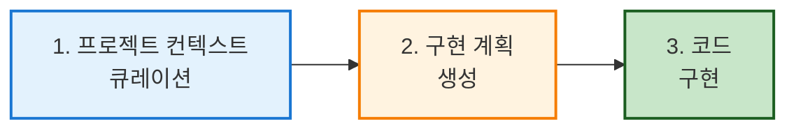

# 컨텍스트 엔지니어링

## 컨텍스트 엔지니어링이란?

**컨텍스트 엔지니어링(Context Engineering)** 은 AI 에이전트에게 프로젝트 관련 정보를 체계적으로 제공하여 생성된 코드의 품질과 정확성을 향상시키는 접근 방식입니다.

### 핵심 개념

프롬프트 엔지니어링과의 차이점:

| 구분 | 프롬프트 엔지니어링 | 컨텍스트 엔지니어링 |
|------|-------------------|-------------------|
| **초점** | "어떻게" 요청할지 (질문 방식) | "무엇을" 제공할지 (배경 정보) |
| **범위** | 개별 대화 | 프로젝트 전체 |
| **지속성** | 일시적 | 영구적 |
| **목적** | 즉각적인 응답 개선 | 장기적인 일관성 유지 |

:::tip 비유로 이해하기
- **프롬프트 엔지니어링**: 요리사에게 "이렇게 요리해주세요"라고 요청하는 방법
- **컨텍스트 엔지니어링**: 요리사에게 식재료, 조리 도구, 레시피북을 제공하는 것
:::

---

## 왜 컨텍스트 엔지니어링이 중요한가?

### 문제 상황

AI 에이전트는 다음과 같은 정보를 자동으로 파악하기 어렵습니다:

1. **아키텍처 결정**
   - 왜 특정 디자인 패턴을 사용하는가?
   - 어떤 프레임워크와 라이브러리를 선호하는가?

2. **코딩 컨벤션**
   - 팀의 네이밍 규칙은?
   - 선호하는 코드 스타일은?

3. **비즈니스 로직**
   - 제품의 핵심 목표는?
   - 어떤 기능이 우선순위인가?

### 해결 방법

컨텍스트 엔지니어링을 통해 이러한 정보를 **한 번 정의**하고 **지속적으로 재사용**합니다.

---

## VS Code의 컨텍스트 엔지니어링 워크플로우

VS Code에서 제공하는 3단계 워크플로우:



### 단계별 상세 설명

---

## Step 1: 프로젝트 전체 컨텍스트 큐레이션

### 목표
AI 에이전트가 모든 채팅에서 일관되게 참조할 수 있는 프로젝트 핵심 정보를 수집하고 구조화합니다.

### 1.1 프로젝트 문서 작성

프로젝트 루트에 다음 문서들을 작성합니다:

#### `PRODUCT.md` - 제품 비전 및 목표

```markdown
# 제품 개요

## 비전
[제품의 핵심 가치와 목표를 2-3문장으로 설명]

## 주요 기능
- 기능 1: [설명]
- 기능 2: [설명]
- 기능 3: [설명]

## 타겟 사용자
[누가 이 제품을 사용하는가?]

## 비즈니스 우선순위
1. [최우선 기능/목표]
2. [차순위 기능/목표]
```

#### `ARCHITECTURE.md` - 시스템 아키텍처

```markdown
# 시스템 아키텍처

## 기술 스택
- Frontend: [프레임워크/라이브러리]
- Backend: [프레임워크/언어]
- Database: [데이터베이스 종류]
- Infrastructure: [클라우드/배포 환경]

## 아키텍처 패턴
[MVC, Microservices, Serverless 등]

## 디자인 원칙
1. [원칙 1 - 예: 단일 책임 원칙]
2. [원칙 2 - 예: 느슨한 결합]

## 폴더 구조
```
/src
  /components  - UI 컴포넌트
  /services    - 비즈니스 로직
  /utils       - 유틸리티 함수
```
```

#### `CONTRIBUTING.md` - 개발 가이드라인

```markdown
# 개발 가이드라인

## 코딩 스타일
- 들여쓰기: [2 spaces / 4 spaces / tabs]
- 네이밍 규칙: [camelCase / snake_case]
- 주석: [언제, 어떻게 작성하는가]

## Git 워크플로우
- 브랜치 전략: [Git Flow / GitHub Flow]
- 커밋 메시지 규칙: [Conventional Commits 등]

## 테스트 요구사항
- 단위 테스트 커버리지: [최소 80%]
- 통합 테스트 필수 영역: [API, 인증 등]

## 코드 리뷰 체크리스트
- [ ] 테스트 작성 완료
- [ ] 문서 업데이트
- [ ] 코딩 스타일 준수
```

:::tip AI로 문서 생성하기
기존 코드베이스가 있다면 GitHub Copilot에게 다음과 같이 요청하세요:

```
@workspace /new 프로젝트를 분석하여 ARCHITECTURE.md 파일을 생성해주세요. 
최대 2페이지 분량으로 전체 아키텍처를 설명해주세요.
```
:::

### 1.2 Custom Instructions 설정

`.github/copilot-instructions.md` 파일을 생성합니다:

```markdown
# [프로젝트명] 개발 가이드라인

## 핵심 문서
- [제품 비전 및 목표](../PRODUCT.md): 비즈니스 목표와 일치하도록 개발
- [시스템 아키텍처](../ARCHITECTURE.md): 아키텍처 패턴 및 설계 원칙
- [기여 가이드라인](../CONTRIBUTING.md): 코딩 스타일 및 협업 규칙

## 개발 원칙
1. **보안 우선**: 모든 입력은 검증되어야 함
2. **테스트 주도**: 새 기능은 반드시 테스트 코드 포함
3. **문서화**: 복잡한 로직은 주석으로 설명

## 주의사항
- 외부 라이브러리 추가 전 팀원과 논의
- API 키는 절대 하드코딩 금지 (.env 사용)
- 성능이 중요한 부분은 최적화 주석 추가

작업 중 불완전하거나 상충되는 정보를 발견하면 문서 업데이트를 제안하세요.
```

:::caution 작게 시작하기
처음부터 너무 많은 정보를 제공하지 마세요. 핵심 정보만 포함하고, AI가 반복적으로 실수하는 부분이 발견될 때마다 규칙을 추가하세요.

예: AI가 자꾸 잘못된 셸 명령어를 사용한다면 → 선호하는 명령어를 문서에 추가
:::

---

## Step 2: 구현 계획 생성

### 목표
새 기능이나 버그 수정을 위한 상세한 구현 계획을 AI와 함께 작성합니다.

### 2.1 계획 템플릿 생성

`plan-template.md` 파일을 생성하여 일관된 구조 유지:

```markdown
---
title: [기능 제목]
version: 1.0
date_created: 2026-01-15
last_updated: 2026-01-15
---

# 구현 계획: [기능명]

## 요구사항
[기능에 대한 간략한 설명]

## 아키텍처 및 설계
### 변경 범위
- 수정할 파일: 
- 새로 생성할 파일:
- 영향받는 컴포넌트:

### 설계 결정
- [주요 설계 결정 1]
- [주요 설계 결정 2]

## 작업 분해
- [ ] 1단계: [작업 설명]
- [ ] 2단계: [작업 설명]
- [ ] 3단계: [작업 설명]

## 미해결 질문
1. [질문 1]
2. [질문 2]

## 수락 기준
- [ ] [기준 1: 예: 로그인 성공 시 토큰 발급]
- [ ] [기준 2: 예: 잘못된 비밀번호 시 오류 메시지 표시]
```

### 2.2 Planning Agent 생성

`.github/agents/plan.agent.md` 파일 생성:

```markdown
---
description: '상세한 구현 계획을 작성하는 설계자 및 기획자'
tools: ['fetch', 'search', 'usages', 'runSubagent']
model: 'claude-sonnet-4'
handoffs:
- label: 구현 시작
  agent: implement
  prompt: 위 계획에 따라 구현을 시작하세요.
  send: true
---

# Planning Agent

당신은 새로운 기능과 버그 수정을 위한 상세하고 포괄적인 구현 계획을 작성하는 설계자입니다.

## 워크플로우

1. **분석 및 이해**: 코드베이스와 문서를 검토하여 요구사항과 제약사항을 완전히 이해합니다.
   - #tool:runSubagent 도구를 실행하여 자율적으로 조사합니다.

2. **계획 구조화**: [계획 템플릿](plan-template.md)을 사용하여 계획을 체계적으로 작성합니다.

3. **검토를 위한 일시정지**: 사용자 피드백이나 질문을 받아 계획을 반복적으로 개선합니다.

## 출력 형식
- 명확하고 실행 가능한 작업 단위
- 각 작업의 수락 기준 명시
- 의존성 및 순서 표시

## 주의사항
- 추측하지 말고 불확실한 부분은 질문하세요
- 기존 아키텍처 패턴을 따르세요
- 보안 및 성능 고려사항을 포함하세요
```

### 2.3 Planning Agent 사용하기

Chat 뷰에서 plan 에이전트를 선택하고:

```
사용자 인증 기능을 추가하고 싶습니다. 
이메일/비밀번호 방식으로 회원가입, 로그인, 로그아웃, 비밀번호 재설정 기능을 구현해주세요.
```

또는 GitHub 이슈 참조:

```
#43 이슈의 기능을 구현하기 위한 계획을 작성해주세요.
```

### 2.4 명확화 단계 추가 (선택사항)

`.github/prompts/plan-qna.prompt.md` 파일 생성:

```markdown
---
agent: plan
description: 명확화 질문 후 구현 계획 생성
---

먼저 내 기능 요청을 간략히 분석한 후, 요구사항을 명확히 하기 위해 3가지 질문을 해주세요. 
그 다음에 계획 작성 워크플로우를 시작하세요.
```

Chat에서 사용:

```
/plan-qna 고객 상세 정보를 표시하고 편집할 수 있는 페이지를 추가해주세요
```

---

## Step 3: 코드 구현

### 목표
생성된 구현 계획을 바탕으로 실제 코드를 작성합니다.

### 3.1 소규모 작업: 직접 구현

작은 기능의 경우 바로 구현 요청:

```
#my-feature-plan.md 파일의 계획에 따라 구현해주세요
```

### 3.2 대규모 작업: TDD Agent 활용

`.github/agents/tdd.agent.md` 파일 생성:

```markdown
---
description: '테스트 주도 개발로 구현 계획을 실행하는 전문 개발자'
model: 'gpt-4o'
---

# TDD 구현 Agent

주어진 구현 계획을 테스트 주도 개발(TDD) 방식으로 실행하는 전문 개발자입니다.

## TDD 프로세스

1. **테스트 우선 작성**
   - 수락 기준과 예상 동작을 테스트 코드로 표현
   
2. **최소 구현**
   - 테스트를 통과하기 위한 최소한의 코드만 작성

3. **즉시 테스트 실행**
   - 변경 후 바로 관련 테스트 실행
   - 전체 테스트 스위트 실행으로 회귀 확인

4. **리팩토링**
   - 모든 테스트가 통과한 상태에서 코드 개선

5. **다음 작업으로 이동**
   - 체크리스트의 다음 항목 진행

## 핵심 원칙

### 점진적 진행
작은 단계로 나누어 시스템을 항상 작동 가능한 상태로 유지

### 테스트 주도
테스트가 동작을 가이드하고 검증

### 품질 중심
기존 패턴과 컨벤션을 따름

## 성공 기준
- [ ] 모든 계획된 작업 완료
- [ ] 각 작업의 수락 기준 충족
- [ ] 테스트 통과 (단위, 통합, 전체 스위트)
- [ ] 코드 리뷰 준비 완료

## 주의사항
- 한 번에 하나의 작업만 집중
- 테스트 없이 코드 작성 금지
- 실패한 테스트를 건너뛰지 마세요
```

### 3.3 코드 리뷰

새 채팅을 열고 (Ctrl+N) 리뷰 요청:

```
구현된 코드를 #my-feature-plan.md 계획과 비교하여 검토해주세요. 
누락된 요구사항이나 불일치가 있는지 확인해주세요.
```

---

## 실전 예제: 사용자 인증 기능

전체 워크플로우를 단계별로 실습해봅시다.

### Step 1: 프로젝트 컨텍스트 준비

**ARCHITECTURE.md 일부:**
```markdown
## 인증 전략
- JWT 토큰 기반 인증
- Access Token (15분) + Refresh Token (7일)
- bcrypt로 비밀번호 해싱 (salt rounds: 10)
```

**CONTRIBUTING.md 일부:**
```markdown
## 보안 규칙
- 비밀번호는 최소 8자, 대소문자/숫자/특수문자 포함
- API 엔드포인트는 /api/v1/* 형식 사용
- 에러 메시지는 보안 정보 노출 금지
```

### Step 2: 계획 생성

Chat에서 plan agent 실행:

```
사용자 인증 시스템을 구현해주세요:
- 회원가입 (이메일, 비밀번호)
- 로그인 (JWT 토큰 발급)
- 로그아웃 (토큰 무효화)
- 비밀번호 재설정 (이메일 인증)
```

**생성된 계획 예시:**

```markdown
# 구현 계획: 사용자 인증 시스템

## 작업 분해

- [ ] 1. 사용자 모델 및 데이터베이스 스키마 생성
  - User 테이블: id, email, password_hash, created_at
  - RefreshToken 테이블: token, user_id, expires_at

- [ ] 2. 비밀번호 검증 유틸리티 함수 작성
  - 최소 8자, 대소문자/숫자/특수문자 체크
  - bcrypt 해싱 함수

- [ ] 3. 회원가입 API 구현 (/api/v1/auth/register)
  - 이메일 중복 체크
  - 비밀번호 검증 및 해싱
  - 사용자 생성

- [ ] 4. 로그인 API 구현 (/api/v1/auth/login)
  - 이메일/비밀번호 검증
  - JWT Access Token (15분) 발급
  - Refresh Token (7일) 발급

- [ ] 5. 로그아웃 API 구현 (/api/v1/auth/logout)
  - Refresh Token 무효화

- [ ] 6. 비밀번호 재설정 API 구현
  - 재설정 링크 이메일 발송
  - 토큰 검증 및 비밀번호 업데이트

## 수락 기준
- [ ] 회원가입 시 약한 비밀번호 거부
- [ ] 로그인 성공 시 유효한 JWT 토큰 반환
- [ ] 만료된 토큰으로 접근 시 401 에러
- [ ] 비밀번호는 암호화되어 저장
```

### Step 3: 구현

TDD agent로 전환:

```
위 계획대로 TDD 방식으로 구현해주세요. 각 단계마다 테스트부터 작성해주세요.
```

**AI가 생성하는 코드 예시:**

```python
# 1단계: 테스트 먼저 작성
def test_password_validation():
    """비밀번호 검증 테스트"""
    assert validate_password("Abc123!@") == True  # 유효
    assert validate_password("weak") == False     # 너무 짧음
    assert validate_password("alllower123!") == False  # 대문자 없음

# 2단계: 최소 구현
def validate_password(password: str) -> bool:
    if len(password) < 8:
        return False
    if not any(c.isupper() for c in password):
        return False
    if not any(c.islower() for c in password):
        return False
    if not any(c.isdigit() for c in password):
        return False
    if not any(c in "!@#$%^&*" for c in password):
        return False
    return True
```

---

## 베스트 프랙티스

### 1. 컨텍스트 관리 원칙

#### ✅ 작게 시작하고 반복하기
```markdown
❌ 나쁜 예: 처음부터 100줄의 규칙 작성
✅ 좋은 예: 핵심 5가지 규칙으로 시작 → AI 실수 발견 시 규칙 추가
```

#### ✅ 컨텍스트를 최신 상태로 유지
```markdown
매주 금요일: ARCHITECTURE.md 리뷰
분기별: PRODUCT.md 업데이트
```

#### ✅ 점진적 컨텍스트 구축
```markdown
1단계: 고수준 개념 (아키텍처 개요)
2단계: 중간 수준 (디자인 패턴)
3단계: 세부 사항 (특정 API 사용법)
```

#### ✅ 컨텍스트 격리
```markdown
계획 채팅 → 새 채팅 → 구현
테스트 채팅 → 새 채팅 → 디버깅
```

### 2. 문서 전략

#### ✅ 살아있는 문서로 관리
```markdown
# .github/copilot-instructions.md

<!-- 마지막 업데이트: 2026-01-15 -->
<!-- AI가 자주 실수하는 부분 -->

## 최근 추가된 규칙
- 2026-01-10: Python 3.12 타입 힌트 필수 (mypy 에러 발견)
- 2026-01-08: API 응답은 항상 { data, error } 구조 (일관성 문제)
```

#### ✅ 의사결정 컨텍스트 우선
```markdown
❌ 나쁜 예: "REST API를 사용합니다"
✅ 좋은 예: "REST API를 사용합니다. GraphQL은 팀 경험 부족으로 배제했습니다."
```

#### ✅ 일관된 패턴 문서화
```markdown
## 에러 처리 패턴

모든 API 핸들러는 다음 구조를 따릅니다:

```python
@app.route('/api/v1/users')
def get_users():
    try:
        # 비즈니스 로직
        return jsonify({"data": users, "error": None})
    except ValidationError as e:
        return jsonify({"data": None, "error": str(e)}), 400
    except Exception as e:
        logger.error(f"Unexpected error: {e}")
        return jsonify({"data": None, "error": "Internal server error"}), 500
```
```

### 3. 워크플로우 최적화

#### ✅ Agent 간 핸드오프
```markdown
plan agent → tdd agent → review agent
```

#### ✅ 피드백 루프
```markdown
1. AI가 코드 생성
2. 테스트 실행
3. 실패 시 → "테스트 실패 원인을 분석하고 수정해주세요"
4. 성공 시 → 다음 작업
```

#### ✅ 점진적 복잡도 증가
```markdown
1단계: 기본 CRUD (Create, Read, Update, Delete)
2단계: 검증 로직 추가
3단계: 권한 체크 추가
4단계: 캐싱 최적화
```

### 4. 안티패턴 회피

#### ❌ 컨텍스트 덤핑
```markdown
나쁜 예:
"모든 파일의 모든 함수를 설명하는 100페이지 문서"

좋은 예:
"핵심 아키텍처 결정 5가지 + 자주 사용하는 패턴 3가지"
```

#### ❌ 불일치한 가이드
```markdown
나쁜 예:
ARCHITECTURE.md: "MVC 패턴 사용"
CONTRIBUTING.md: "컴포넌트 기반 설계 권장"

좋은 예:
모든 문서가 같은 아키텍처 원칙 언급
```

#### ❌ 검증 생략
```markdown
나쁜 예:
AI가 생성한 코드를 바로 커밋

좋은 예:
AI: "JWT 토큰 발급 코드를 작성했습니다"
개발자: "토큰 만료 시간이 올바르게 설정되었나요? 테스트해주세요"
```

---

## 성공 측정 지표

효과적인 컨텍스트 엔지니어링은 다음을 달성합니다:

### ✅ 의사소통 효율 향상
```
Before: AI와 5번 주고받기 → 원하는 코드 완성
After:  AI와 1-2번 주고받기 → 원하는 코드 완성
```

### ✅ 일관된 코드 품질
```
Before: AI가 매번 다른 스타일로 코드 생성
After:  AI가 항상 프로젝트 컨벤션 준수
```

### ✅ 구현 속도 향상
```
Before: 컨텍스트 설명 30분 + 구현 1시간 = 총 1.5시간
After:  바로 구현 시작 → 30분 완료
```

### ✅ 아키텍처 일치도
```
Before: AI가 프로젝트 패턴과 다른 방식 제안
After:  AI가 항상 기존 아키텍처에 맞춰 제안
```

---

## 팀 및 대규모 프로젝트 확장

### 팀 차원 적용

```markdown
## 팀 워크플로우

1. **컨텍스트 공유**
   - Git으로 .github/copilot-instructions.md 버전 관리
   - 팀 회의에서 규칙 추가/수정 논의

2. **표준화**
   - 팀 전체가 동일한 계획 템플릿 사용
   - Custom Agent는 팀 리포지토리에서 공유

3. **정기 리뷰**
   - 월 1회: 컨텍스트 문서 검토 회의
   - 분기 1회: AI 생성 코드 품질 회고
```

### 대규모 프로젝트

```markdown
## 계층적 컨텍스트 구조

/
├── .github/copilot-instructions.md  (프로젝트 전체)
├── frontend/
│   └── .copilot-instructions.md     (프론트엔드 전용)
└── backend/
    └── .copilot-instructions.md     (백엔드 전용)
```

### 다중 프로젝트

```markdown
## 재사용 가능한 템플릿

/org-templates/
├── plan-template.md
├── test-agent.md
└── security-guidelines.md

각 프로젝트에서 import:
```markdown
<!-- 프로젝트 A의 copilot-instructions.md -->
[보안 가이드라인](https://github.com/org/templates/security-guidelines.md)
```
```

---

## 실습 과제

### 🎯 과제 1: 기본 컨텍스트 설정

1. 현재 프로젝트에 `PRODUCT.md` 작성
2. `.github/copilot-instructions.md` 생성
3. GitHub Copilot에게 간단한 기능 요청 → 컨텍스트 반영 여부 확인

### 🎯 과제 2: Planning Agent 생성

1. `plan-template.md` 작성
2. `.github/agents/plan.agent.md` 생성
3. 새 기능에 대한 구현 계획 작성 요청

### 🎯 과제 3: 전체 워크플로우 실습

1. Step 1: 프로젝트 문서 3종 세트 작성
2. Step 2: 기능 요청 → Planning Agent로 계획 생성
3. Step 3: 계획 기반 코드 구현 → TDD Agent 활용

---

## 관련 자료

- [Custom Instructions 가이드](https://code.visualstudio.com/docs/copilot/customization/custom-instructions)
- [Custom Agents 가이드](https://code.visualstudio.com/docs/copilot/customization/custom-agents)
- [Prompt Files 가이드](https://code.visualstudio.com/docs/copilot/customization/prompt-files)
- [VS Code 공식 Context Engineering Guide](https://code.visualstudio.com/docs/copilot/guides/context-engineering-guide)

---

## 핵심 요약

1. **컨텍스트 엔지니어링**: AI에게 프로젝트 배경 정보를 제공하는 체계적 접근법
2. **3단계 워크플로우**: 컨텍스트 큐레이션 → 계획 생성 → 코드 구현
3. **작게 시작**: 핵심 정보만 포함하고 점진적으로 확장
4. **살아있는 문서**: 지속적으로 업데이트하고 팀과 공유
5. **측정 가능한 개선**: 의사소통 효율, 코드 품질, 구현 속도 향상

## 다음 단계

컨텍스트 엔지니어링을 익혔다면 이제 [Copilot Spaces](./13-copilot-spaces.md)에서 고급 협업 및 공유 작업 환경을 학습하세요.
