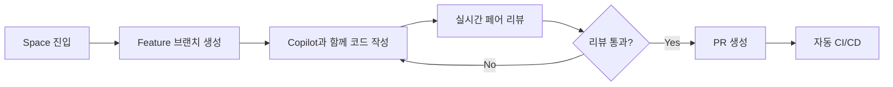

# GitHub Copilot Spaces

## 개요

GitHub Copilot Spaces는 AI 기반 협업 개발 환경으로, 팀원들과 실시간으로 코드를 작성하고 리뷰할 수 있는 통합 워크스페이스입니다.

## Copilot Spaces란?

### 주요 특징

**실시간 협업**
- 여러 개발자가 동시에 같은 코드베이스 작업
- 실시간 코드 동기화
- 즉각적인 피드백 및 제안

**AI 기반 워크플로우**
- 컨텍스트 인식 코드 제안
- 자동 코드 리뷰
- 지능형 리팩토링 제안

**통합 개발 환경**
- VS Code 기반 인터페이스
- 브라우저에서 바로 접근 가능
- 로컬 환경 설정 불필요

## Spaces 시작하기

### 1. Space 생성

```bash
# GitHub CLI 사용
gh copilot-spaces create my-project-space

# 또는 웹 인터페이스에서
# github.com → Copilot → Spaces → New Space
```

### 2. 프로젝트 설정

```yaml
# .github/copilot-space.yml
name: "MyProject Development Space"
description: "팀 협업 개발 환경"

workspace:
  # 개발 환경 설정
  devcontainer: ".devcontainer/devcontainer.json"
  
  # 기본 브랜치
  default_branch: "main"
  
  # 자동 실행 스크립트
  postCreateCommand: "npm install && npm run setup"

features:
  # AI 기능 활성화
  copilot:
    enabled: true
    features:
      - code-completion
      - chat
      - review
      - refactor
  
  # 협업 기능
  collaboration:
    real_time_editing: true
    shared_terminal: true
    voice_chat: false

# 접근 권한
access:
  - team: "developers"
    role: "write"
  - team: "reviewers"
    role: "read"
```

### 3. Dev Container 설정

```json
// .devcontainer/devcontainer.json
{
  "name": "MyProject Space",
  "image": "mcr.microsoft.com/devcontainers/typescript-node:18",
  
  "features": {
    "ghcr.io/devcontainers/features/github-cli:1": {},
    "ghcr.io/devcontainers/features/docker-in-docker:2": {}
  },
  
  "customizations": {
    "vscode": {
      "extensions": [
        "GitHub.copilot",
        "GitHub.copilot-chat",
        "dbaeumer.vscode-eslint",
        "esbenp.prettier-vscode"
      ],
      "settings": {
        "github.copilot.enable": {
          "*": true
        }
      }
    }
  },
  
  "postCreateCommand": "npm install",
  "postStartCommand": "npm run dev",
  
  "forwardPorts": [3000, 5432],
  "portsAttributes": {
    "3000": {
      "label": "Application",
      "onAutoForward": "notify"
    }
  }
}
```

## Spaces 주요 기능

### 실시간 협업 편집

**동시 편집**
```typescript
// 개발자 A와 B가 동시에 같은 파일 편집 가능
// 각자의 커서 위치가 실시간으로 표시됨

interface User {
  id: string;
  name: string;
  // 개발자 A가 작성 중...
  email: string;
  // 개발자 B가 작성 중...
  role: UserRole;
}
```

**Live Share 통합**
- 커서 위치 공유
- 코드 하이라이트
- 음성/채팅 통합

### AI 기반 코드 리뷰

**자동 리뷰 제안**
```javascript
// Copilot이 자동으로 코드 이슈 탐지 및 제안

// ⚠️ Copilot Suggestion: 에러 핸들링 추가 필요
async function fetchUserData(userId) {
  const response = await fetch(`/api/users/${userId}`);
  return response.json();
}

// ✅ Improved Version
async function fetchUserData(userId) {
  try {
    const response = await fetch(`/api/users/${userId}`);
    
    if (!response.ok) {
      throw new Error(`HTTP error! status: ${response.status}`);
    }
    
    return await response.json();
  } catch (error) {
    console.error('Failed to fetch user data:', error);
    throw error;
  }
}
```

### 팀 프롬프트 라이브러리

**공유 프롬프트 템플릿**
```markdown
# .github/copilot-prompts/

## api-endpoint.md
REST API 엔드포인트를 생성해주세요:
- Express.js 사용
- TypeScript
- 입력 검증 포함
- 에러 핸들링
- OpenAPI 문서 주석

## react-component.md
React 컴포넌트를 생성해주세요:
- TypeScript + Hooks
- Props 타입 정의
- 접근성 고려
- 반응형 디자인
```

### 컨텍스트 공유

**프로젝트 컨텍스트 자동 공유**
```yaml
# Space 내 모든 개발자가 동일한 컨텍스트 공유
context:
  codebase: "전체 리포지토리"
  documentation: "README, Wiki"
  issues: "Open Issues"
  pull_requests: "Active PRs"
  dependencies: "package.json, requirements.txt"
```

## 워크플로우 예제

### 1. Feature 개발 워크플로우



**실제 예제**
```typescript
// Space에서 팀원과 함께 개발
// Copilot Chat 사용: "사용자 프로필 업데이트 API 만들어줘"

import { Router } from 'express';
import { body, validationResult } from 'express-validator';

const router = Router();

// Copilot이 자동 생성한 엔드포인트
router.patch(
  '/users/:id',
  [
    body('name').optional().isString().trim(),
    body('email').optional().isEmail(),
    body('bio').optional().isString().isLength({ max: 500 })
  ],
  async (req, res) => {
    const errors = validationResult(req);
    if (!errors.isEmpty()) {
      return res.status(400).json({ errors: errors.array() });
    }
    
    // 팀원이 실시간으로 리뷰하며 개선
    const { id } = req.params;
    const updates = req.body;
    
    try {
      const updatedUser = await userService.updateProfile(id, updates);
      res.json({ success: true, data: updatedUser });
    } catch (error) {
      res.status(500).json({ error: 'Failed to update profile' });
    }
  }
);
```

### 2. 버그 수정 워크플로우

```typescript
// Copilot Chat: "이 코드의 버그를 찾아줘"

// 🐛 원본 코드 (버그 있음)
function calculateDiscount(price: number, discountPercent: number) {
  return price - (price * discountPercent / 100);
}

// ✅ Copilot이 개선 제안
function calculateDiscount(price: number, discountPercent: number): number {
  // 입력 검증 추가
  if (price < 0 || discountPercent < 0 || discountPercent > 100) {
    throw new Error('Invalid input parameters');
  }
  
  // 부동소수점 오류 방지
  const discount = Math.round(price * discountPercent) / 100;
  return Math.max(0, price - discount);
}

// 팀원이 실시간으로 테스트 추가
describe('calculateDiscount', () => {
  it('should calculate discount correctly', () => {
    expect(calculateDiscount(100, 10)).toBe(90);
  });
  
  it('should handle edge cases', () => {
    expect(() => calculateDiscount(-100, 10)).toThrow();
    expect(() => calculateDiscount(100, 150)).toThrow();
  });
});
```

## 협업 베스트 프랙티스

### Do's ✅

1. **명확한 커뮤니케이션**
   - 작업 중인 파일/함수 공지
   - 변경 사항 실시간 설명
   - 코드 리뷰 피드백 즉시 반영

2. **컨벤션 준수**
   - 팀 코딩 스탠다드 따르기
   - Copilot instructions 활용
   - 일관된 커밋 메시지

3. **AI 제안 검증**
   - Copilot 제안 무조건 수용 금지
   - 팀원과 함께 검토
   - 보안/성능 영향 고려

### Don'ts ❌

1. **동시 편집 충돌**
   - 같은 라인 동시 수정 지양
   - 작업 영역 미리 조율
   - 변경 사항 자주 커밋

2. **컨텍스트 무시**
   - 프로젝트 가이드라인 위반
   - 독단적 의사결정
   - 문서화 소홀

## 유용한 단축키

```
Ctrl/Cmd + Shift + L    : Live Share 시작
Ctrl/Cmd + Shift + P    : Copilot Chat 열기
Alt + [                 : 이전 Copilot 제안
Alt + ]                 : 다음 Copilot 제안
Ctrl/Cmd + Enter        : Copilot 제안 수락
```

## 다음 단계

다음 섹션에서는 Copilot Spaces를 활용한 Vibe 코딩 실전 방법을 학습합니다.

---

**참고 자료**
- [GitHub Copilot Spaces 문서](https://docs.github.com/copilot/copilot-spaces)
- [Dev Containers 가이드](https://containers.dev/)
