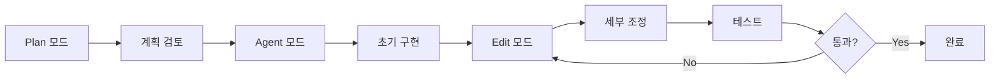
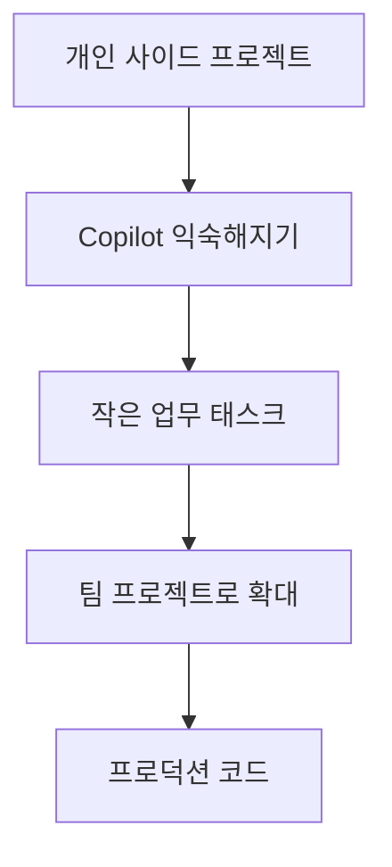

# 워크숍 마무리 및 Best Practices

## 🎓 학습 내용 복습

이 워크숍에서 우리는 GitHub Copilot의 다양한 기능과 활용법을 배웠습니다. 핵심 내용을 정리해봅시다.

### 1. GitHub Copilot 기본기

✅ **배운 내용:**
- Copilot의 작동 원리와 AI 모델
- 코드 자동완성 및 제안 활용
- Copilot Chat을 통한 대화형 코딩
- 슬래시 명령어 (/explain, /fix, /tests)

💡 **핵심 포인트:**
- Copilot은 도구일 뿐, 여러분의 판단력이 더 중요합니다
- 제안을 맹목적으로 수용하지 말고 항상 검토하세요
- 컨텍스트가 좋은 제안의 핵심입니다

### 2. 효과적인 프롬프트 엔지니어링

✅ **배운 내용:**
- 명확하고 구체적인 프롬프트 작성
- 컨텍스트 제공의 중요성
- 함수명, 변수명, 주석의 전략적 활용

💡 **핵심 포인트:**
```text
나쁜 프롬프트: "함수 만들어줘"
좋은 프롬프트: "사용자 이메일 유효성을 검증하는 함수를 만들어주세요. 
RFC 5322 표준을 따르고, 잘못된 형식일 경우 구체적인 에러 메시지를 반환해야 합니다."
```

### 3. Copilot 모드 마스터

✅ **배운 내용:**
- **Ask 모드**: 질문과 학습
- **Edit 모드**: 검토 가능한 코드 수정
- **Agent 모드**: 자율적 멀티스텝 작업
- **Plan 모드**: 실행 전 계획 수립

💡 **핵심 포인트:**

| 상황 | 추천 모드 |
|------|----------|
| 빠른 확인 | Ask |
| 정밀한 수정 | Edit |
| 대규모 구현 | Agent |
| 복잡한 작업 전 | Plan |

### 4. 커스텀 설정과 최적화

✅ **배운 내용:**
- `.github/copilot-instructions.md` 작성
- 팀 규칙 및 스타일 가이드 적용
- 프로젝트별 컨텍스트 제공

💡 **핵심 포인트:**
- 커스텀 인스트럭션은 팀 전체의 생산성을 높입니다
- 프로젝트 시작 시 바로 설정하세요
- 지속적으로 업데이트하고 개선하세요

### 5. 실전 프로젝트 경험

✅ **배운 내용:**
- Vibe 코딩으로 빠른 프로토타이핑
- 레거시 코드 리팩토링
- CI/CD 파이프라인 자동화
- 블로그 및 웹 앱 구축
- 오픈소스 기여

💡 **핵심 포인트:**
- 실제 프로젝트에서 배우는 것이 가장 효과적입니다
- 작은 것부터 시작해서 점진적으로 확장하세요
- 실수를 두려워하지 마세요 (Git이 있습니다!)

---

## 🏆 Best Practices

### 코드 품질 유지

#### 1. 항상 Diff를 읽으세요

```
⚠️ ALWAYS READ THE DIFF ⚠️
```

Copilot이 생성한 모든 코드는 반드시 검토하세요:
- 로직의 정확성
- 보안 취약점
- 성능 이슈
- 코드 스타일 일관성

#### 2. 테스트는 필수

```python
# Copilot으로 구현 생성 후
# "/tests 이 함수에 대한 테스트를 작성해주세요"
import pytest
import re

def validate_email(email: str) -> bool:
    """ 이메일 유효성 검증 """
    pattern = r'^[\w\.-]+@[\w\.-]+\.\w+$'
    return bool(re.match(pattern, email))

def test_validate_email_accepts_valid_email():
    assert validate_email('user@example.com') == True

def test_validate_email_rejects_invalid_format():
    assert validate_email('invalid-email') == False

# Copilot이 엣지 케이스도 제안합니다
def test_validate_email_handles_special_characters():
    assert validate_email('user+tag@example.com') == True
```
```

#### 3. 보안 검토

```python
# ❌ Copilot 제안을 그대로 사용하지 마세요
password = request.form.get('password')  # SQL Injection 가능!

# ✅ 검증 및 sanitization 추가
from html import escape
import re

password = escape(request.form.get('password', ''))
if not is_valid_password(password):
    raise ValueError('Invalid password format')

def is_valid_password(password: str) -> bool:
    """ 비밀번호 유효성 검증 """
    if len(password) < 8:
        return False
    if not re.search(r'[A-Z]', password):
        return False
    if not re.search(r'[a-z]', password):
        return False
    if not re.search(r'\d', password):
        return False
    return True
```
```

### 효율적인 워크플로우

#### 1. 점진적 개발



#### 2. Git 활용

```bash
# 작업 시작 전 브랜치 생성
git checkout -b feature/copilot-generated

# 작은 단위로 커밋
git add .
git commit -m "feat: add user validation with Copilot"

# 문제 발생시 쉽게 되돌리기
git reset --hard HEAD~1
```

#### 3. 문서화

```javascript
/**
 * Copilot으로 생성된 함수도 문서화하세요
 * 
 * @param {string} userId - 사용자 ID
 * @returns {Promise<User>} 사용자 객체
 * @throws {NotFoundError} 사용자를 찾을 수 없을 때
 * 
 * @example
 * const user = await getUserById('123');
 */
async function getUserById(userId) {
  // Copilot이 구현을 제안합니다
}
```

### 팀 협업

#### 1. 커스텀 인스트럭션 공유

```markdown title=".github/copilot-instructions.md"
# 우리 팀의 개발 원칙

## 코드 스타일
- Python mypy strict 모드 사용
- ESLint + Prettier 규칙 준수
- 함수는 20줄 이내로 제한

## 금지 사항
- any 타입 사용 금지
- console.log 프로덕션 코드에 남기지 않기
- 하드코딩된 문자열 대신 상수 사용

## 필수 사항
- 모든 public 함수에 JSDoc 추가
- 단위 테스트 커버리지 80% 이상
- Pull Request 템플릿 작성
```

#### 2. 코드 리뷰 문화

```text
PR 리뷰 시 체크리스트:
□ Copilot 생성 코드를 직접 검토했는가?
□ 테스트가 충분한가?
□ 보안 이슈가 없는가?
□ 성능 문제가 없는가?
□ 문서화가 되어 있는가?
```

#### 3. 지식 공유

```markdown
# 팀 Wiki: Copilot 사용 팁

## 성공 사례
- Agent 모드로 30분만에 CRUD API 완성
- Edit 모드로 레거시 코드 리팩토링 (2일 → 4시간)

## 주의 사항
- legacy-auth 모듈은 수동으로 수정 (Copilot이 잘못 이해함)
- DB 마이그레이션은 Agent 모드 사용 금지

## 유용한 프롬프트 모음
- "이 API를 RESTful 원칙에 맞게 리팩토링해주세요"
- "이 함수의 성능을 최적화해주세요. Big O 분석 포함"
```

---

## 💼 실무 적용 전략

### 1단계: 개인 프로젝트에서 시작



### 2단계: 팀 도입

**Week 1-2: 파일럿 프로그램**
- 2-3명의 얼리어답터 선정
- 비중요 프로젝트에서 시작
- 피드백 수집

**Week 3-4: 확산**
- 워크숍 진행 (이 과정 공유)
- 베스트 프랙티스 문서화
- 커스텀 인스트럭션 작성

**Week 5+: 전면 도입**
- 전체 팀 라이선스 구매
- 정기적인 지식 공유 세션
- 성과 측정 및 개선

### 3단계: 측정 및 개선

**측정 지표:**
```text
□ 개발 시간 단축: ____%
□ 코드 리뷰 시간: ____%
□ 버그 발견율: ____%
□ 개발자 만족도: ___점
□ 코드 품질 점수: ___점
```

---

## 🚀 다음 단계

### 단기 목표 (1-3개월)

1. **일상적으로 Copilot 사용하기**
   - 모든 코딩 작업에 Copilot 활용
   - 다양한 모드 실험
   - 개인 프롬프트 라이브러리 구축

2. **커스텀 설정 최적화**
   - 프로젝트별 인스트럭션 작성
   - 팀 규칙 문서화
   - 지속적 개선

3. **오픈소스 기여**
   - 월 1개 이상 PR 제출
   - Copilot 활용 경험 공유
   - 커뮤니티 참여

### 중기 목표 (3-6개월)

1. **팀 전문가 되기**
   - 동료에게 Copilot 교육
   - 베스트 프랙티스 전파
   - 사내 워크숍 진행

2. **생산성 극대화**
   - 자주 사용하는 패턴 자동화
   - 워크플로우 최적화
   - 성과 측정 및 공유

3. **고급 기능 활용**
   - Copilot Extensions 탐색
   - 커스텀 도구 통합
   - AI 워크플로우 구축

### 장기 목표 (6개월+)

1. **조직 차원 변화 주도**
   - AI 기반 개발 문화 구축
   - 전사 표준 수립
   - ROI 측정 및 보고

2. **지속적 학습**
   - 새로운 Copilot 기능 학습
   - AI 개발 트렌드 파악
   - 커뮤니티 기여

---

## 📚 지속적인 학습 리소스

### 공식 문서

- [GitHub Copilot 공식 문서](https://docs.github.com/en/copilot)
- [VS Code Copilot 가이드](https://code.visualstudio.com/docs/copilot)
- [Copilot 블로그](https://github.blog/tag/github-copilot/)

### 커뮤니티

- [GitHub Community Discussion](https://github.com/orgs/community/discussions/categories/copilot)
- [Stack Overflow - GitHub Copilot 태그](https://stackoverflow.com/questions/tagged/github-copilot)
- [Reddit - r/github](https://www.reddit.com/r/github/)

### 뉴스레터 & 블로그

- [GitHub Newsletter](https://github.blog/newsletter/)
- [The GitHub Blog](https://github.blog/)
- [Microsoft Developer Blog](https://devblogs.microsoft.com/)

### 비디오 & 튜토리얼

- [GitHub YouTube Channel](https://www.youtube.com/@GitHub)
- [Microsoft Learn - GitHub Copilot](https://learn.microsoft.com/en-us/training/browse/?terms=github%20copilot)
- [GitHub Skills](https://skills.github.com/)

### 책 & 가이드

- "GitHub Copilot in Action" (Manning Publications)
- "AI-Powered Development with GitHub Copilot"
- GitHub Copilot Cookbook (GitHub 공식)

---

## 🌐 커뮤니티 참여 및 네트워킹

### 오프라인 이벤트

- **GitHub Universe**: 연례 개발자 컨퍼런스
- **로컬 개발자 밋업**: GitHub User Groups
- **핵토버페스트**: 오픈소스 기여 이벤트

### 온라인 커뮤니티

```markdown
### 한국 커뮤니티
- 🇰🇷 GitHub Korea User Group
- 💬 Discord/Slack 채널
- 📱 Kakao/Telegram 그룹

### 글로벌 커뮤니티
- 🌍 GitHub Discussions
- 💻 Dev.to - #githubcopilot
- 🐦 Twitter - #GitHubCopilot
```

### 경험 공유

- **블로그 포스팅**: 사용 경험 공유
- **기술 세미나**: 발표 기회 활용
- **멘토링**: 초보자 도움
- **오픈소스**: 프로젝트 시작

---

## ❓ 자주 묻는 질문 (FAQ)

### Q1: Copilot이 생성한 코드의 저작권은?

**A:** GitHub Copilot이 생성한 코드는 여러분의 것입니다. 하지만 오픈소스 라이선스를 준수하는지 확인하세요.

### Q2: 민감한 정보를 Copilot에 보내도 되나요?

**A:** 
- ❌ API 키, 비밀번호, 개인정보는 코드에 포함하지 마세요
- ✅ 환경 변수나 시크릿 관리 도구 사용
- ✅ 기업용 Copilot은 데이터를 학습에 사용하지 않습니다

### Q3: Copilot이 틀린 코드를 제안하면?

**A:** 
1. Thumbs down으로 피드백 제공
2. 프롬프트를 더 명확하게 수정
3. 다른 모드 시도 (Ask → Edit)
4. 수동으로 수정 후 학습

### Q4: 개발자로서의 성장이 느려질까요?

**A:** 
- ❌ 맹목적으로 따라 하면 성장 정체
- ✅ 학습 도구로 활용하면 오히려 빠른 성장
- 항상 "왜?"를 묻고, 코드를 이해하세요

### Q5: 비용 대비 효과가 있나요?

**A:** 
```text
개인: $10/월
비즈니스: $19/월/사용자
엔터프라이즈: 문의

일반적인 ROI:
- 개발 시간 30-50% 단축
- 코드 품질 향상
- 학습 곡선 완화
→ 투자 대비 높은 효과
```

---

## 🎯 행동 계획

### 이번 주 실천 항목

```markdown
## Week 1 TODO

### 환경 설정
- [ ] VS Code에 최신 Copilot 확장 설치
- [ ] 프로젝트에 .github/copilot-instructions.md 생성
- [ ] 팀원들과 Copilot 설정 공유

### 실습
- [ ] Ask 모드로 기존 코드 이해하기
- [ ] Edit 모드로 작은 리팩토링 1건 완료
- [ ] Agent 모드로 새 기능 1개 구현

### 공유
- [ ] 학습 내용 블로그 포스팅
- [ ] 팀 미팅에서 경험 공유
- [ ] 유용한 프롬프트 문서화
```

### 이번 달 목표

```markdown
## Month 1 Goals

- [ ] 모든 코딩 작업에 Copilot 활용
- [ ] 오픈소스 프로젝트 1개 기여
- [ ] 팀 베스트 프랙티스 문서 작성
- [ ] 지식 공유 세션 1회 진행
- [ ] 생산성 향상 측정 및 기록
```

---

## 🎊 마무리

### 핵심 메시지

```
🌟 GitHub Copilot은 도구입니다
🧠 여러분의 판단력이 핵심입니다
📈 지속적인 학습이 중요합니다
🤝 커뮤니티와 함께 성장하세요
```

### 성공을 위한 3가지 원칙

1. **신뢰하되 검증하라**
   - Copilot을 믿되, 모든 코드를 리뷰하세요

2. **작게 시작해서 크게 확장하라**
   - 개인 프로젝트 → 팀 프로젝트 → 프로덕션

3. **배우고 공유하라**
   - 경험을 문서화하고 커뮤니티에 기여하세요

---

## 💬 연락하기

질문이나 피드백이 있으신가요?

- 📧 이슈 제기: [GitHub Issues](https://github.com/dotnetpower/gh-copilot-workshop-hol/issues)
- 💬 디스커션: [GitHub Discussions](https://github.com/dotnetpower/gh-copilot-workshop-hol/discussions)
- 🌟 프로젝트 Star 주기

---

## 🙏 감사합니다!

이 워크숍을 완료하신 것을 진심으로 축하드립니다! 

여러분은 이제:
- ✅ GitHub Copilot의 모든 주요 기능을 이해했습니다
- ✅ 실전 프로젝트에서 Copilot을 활용할 수 있습니다
- ✅ 팀과 조직에 Copilot을 도입할 수 있습니다
- ✅ AI 기반 개발의 미래를 준비했습니다

**이제 여러분의 차례입니다!**

AI와 함께하는 개발의 새로운 시대에서 성공하시길 바랍니다. 

Happy Coding with GitHub Copilot! 🚀

---

<div style={{textAlign: 'center', marginTop: '3rem', padding: '2rem', background: 'linear-gradient(135deg, #667eea 0%, #764ba2 100%)', borderRadius: '10px', color: 'white'}}>
  <h2>🎓 Certificate of Completion</h2>
  <p style={{fontSize: '1.2rem', margin: '1rem 0'}}>
    당신은 GitHub Copilot Workshop을 성공적으로 완료했습니다!
  </p>
  <p style={{fontSize: '0.9rem', opacity: 0.9}}>
    이제 AI 파트너와 함께 더 나은 코드를 작성하세요
  </p>
</div>
