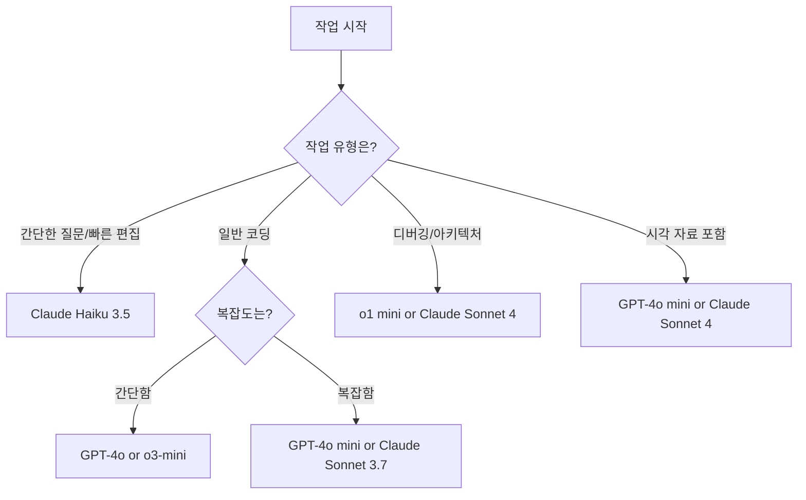

# AI 모델 비교

## 개요

GitHub Copilot은 여러 AI 모델을 지원하며, 선택한 모델에 따라 Copilot Chat 응답과 인라인 제안의 품질 및 관련성이 달라집니다. 일부 모델은 낮은 지연 시간을 제공하고, 다른 모델은 특정 작업에서 더 나은 성능을 보이거나 환각(hallucination)을 줄입니다. 

이 가이드는 모델 이름이 아닌 **작업 기반**으로 최적의 모델을 선택하는 데 도움을 줍니다.

:::tip 참고사항
- 모델마다 프리미엄 요청 배수(multiplier)가 다르므로 월간 사용량 한도에 영향을 줄 수 있습니다.
- IDE에서 Copilot Chat을 사용할 때 **Auto** 모드는 가용성에 따라 자동으로 최적의 모델을 선택합니다.
- 수동으로 다른 모델을 선택하여 이를 재정의할 수 있습니다.
:::

---

## 작업별 추천 모델 요약

| 모델 | 주요 용도 | 강점 | 지원 기능 |
|------|----------|------|-----------|
| **GPT-4o** | 범용 코딩 및 작성 | 빠르고 정확한 코드 완성 및 설명 | Agent 모드, 비전 |
| **GPT-4o mini** | 범용 코딩 및 작성 | 빠르고 정확한 코드 완성 및 설명 | Agent 모드, 추론, 비전 |
| **o1** | 심층 추론 및 디버깅 | 다단계 문제 해결 및 아키텍처 수준 코드 분석 | Agent 모드 |
| **o1 mini** | 심층 추론 및 디버깅 | o1보다 빠른 응답과 낮은 리소스로 심층 추론 제공 | Agent 모드 |
| **o3-mini** | 범용 코딩 및 작성 | 복잡한 엔지니어링 작업에서 고품질 코드 생성 | Agent 모드 |
| **Claude Haiku 3.5** | 빠른 반복 작업 | 빠르고 안정적인 답변 제공 | Agent 모드 |
| **Claude Sonnet 3.7** | 범용 코딩 및 에이전트 작업 | 복잡한 문제 해결, 정교한 추론 | Agent 모드 |
| **Claude Sonnet 4** | 심층 추론 및 디버깅 | 성능과 실용성의 균형, 코딩 워크플로우에 최적화 | Agent 모드, 비전 |
| **Claude Opus 4** | 심층 추론 및 디버깅 | Anthropic의 가장 강력한 모델, 복잡한 문제 해결 | 추론, 비전 |
| **Gemini 2.0 Flash** | 범용 코딩 및 작성 | 빠르고 효율적인 코드 생성 | Agent 모드 |
| **Gemini 2.0 Flash Thinking** | 심층 추론 및 디버깅 | 복잡한 코드 생성, 디버깅, 연구 워크플로우 | 추론 |
| **Gemini 2.5 Pro** | 심층 추론 및 디버깅 | 고급 추론 및 긴 컨텍스트 분석 | 추론, 비전 |
| **Grok Code Fast 1** | 범용 코딩 및 작성 | 빠르고 정확한 코드 완성 및 설명 | Agent 모드 |
| **Qwen 2.5 Coder 32B** | 범용 코딩 및 작성 | 코드 생성, 추론, 코드 수정/디버깅 | 추론 |

:::info Grok Code Fast 1 무료 제공
Grok Code Fast 1에 대한 무료 액세스는 이전에 발표된 종료 시점을 넘어 계속됩니다. 새로운 종료 날짜는 아직 설정되지 않았으며, 언제든지 업데이트되거나 종료될 수 있습니다.
:::

---

## 작업 1: 범용 코딩 및 작성

### 개요
일반적인 개발 작업에 품질, 속도, 비용 효율성의 균형이 필요할 때 사용합니다. 특별한 요구사항이 없을 때 좋은 기본 선택입니다.

### 추천 모델

#### GPT-4o
- 범용 코딩 및 작성 작업에 적합
- 빠르고 정확한 코드 완성 및 설명 제공
- Agent 모드와 비전 기능 지원

#### GPT-4o mini
- 대부분의 코딩 및 작성 작업에 신뢰할 수 있는 기본 모델
- 빠르고 정확하며 다양한 언어와 프레임워크에서 잘 작동
- Agent 모드, 추론, 비전 기능 모두 지원

#### o3-mini
- 복잡한 엔지니어링 작업(기능, 테스트, 디버깅, 리팩토링, 리뷰)에서 긴 지침 없이도 고품질 코드 제공

#### Claude Sonnet 3.7
- 복잡한 문제 해결과 정교한 추론에 강점
- Agent 모드 지원

#### Gemini 2.0 Flash
- 빠르고 효율적인 코드 생성
- 범용 개발 작업에 적합

#### Grok Code Fast 1
- 코딩 작업에 특화
- 여러 언어에서 코드 생성 및 디버깅에 우수한 성능

#### Qwen 2.5 Coder 32B
- 코드 생성, 추론, 코드 수정 및 디버깅에 강점

### 언제 사용하나요?

**✅ 이럴 때 사용하세요:**
- 함수, 짧은 파일 또는 코드 diff 작성이나 검토
- 문서, 주석 또는 요약 생성
- 오류나 예상치 못한 동작을 빠르게 설명
- 영어가 아닌 프로그래밍 환경에서 작업

**⚠️ 다른 모델을 고려하세요:**
- 복잡한 리팩토링, 아키텍처 결정, 다단계 로직 → **심층 추론 및 디버깅** 모델
- 빠르고 간단한 작업(반복적인 편집, 일회성 코드 제안) → **빠른 반복 작업** 모델

---

## 작업 2: 빠른 반복 작업

### 개요
속도와 응답성에 최적화된 모델입니다. 빠른 편집, 유틸리티 함수, 구문 도움, 가벼운 프로토타이핑에 이상적입니다. 불필요한 깊이나 긴 추론 체인 없이 빠른 답변을 얻을 수 있습니다.

### 추천 모델

#### Claude Haiku 3.5
- 빠른 응답과 품질 출력의 균형
- 소규모 작업과 가벼운 코드 설명에 이상적
- 반복적인 편집이나 유틸리티 함수 작성에 최적

### 언제 사용하나요?

**✅ 이럴 때 사용하세요:**
- 작은 함수나 유틸리티 코드 작성 또는 편집
- 빠른 구문이나 언어 질문
- 최소한의 설정으로 아이디어 프로토타이핑
- 간단한 프롬프트나 편집에 대한 빠른 피드백

**⚠️ 다른 모델을 고려하세요:**
- 복잡한 리팩토링, 아키텍처 결정, 다단계 로직 → **심층 추론 및 디버깅** 모델
- 더 강력한 범용 추론이나 구조화된 출력 → **범용 코딩 및 작성** 모델

---

## 작업 3: 심층 추론 및 디버깅

### 개요
단계별 추론, 복잡한 의사결정 또는 높은 컨텍스트 인식이 필요한 작업을 위해 설계되었습니다. 구조화된 분석, 신중한 코드 생성 또는 여러 파일에 걸친 이해가 필요할 때 잘 작동합니다.

### 추천 모델

#### o1 mini
- o1보다 빠른 응답과 낮은 리소스 사용으로 심층 추론 및 디버깅 제공
- 대화형 세션 및 단계별 코드 분석에 이상적

#### o1
- 복잡한 추론, 코드 분석, 기술적 의사결정에 탁월
- 다단계 문제 해결 및 아키텍처 수준 분석

#### Claude Sonnet 4
- 3.7 대비 더 안정적인 완성과 압박 상황에서 더 스마트한 추론으로 개선
- 성능과 실용성의 균형, 코딩 워크플로우에 최적화
- Agent 모드 및 비전 기능 지원

#### Claude Opus 4
- Anthropic의 가장 강력한 모델
- 복잡한 문제 해결, 정교한 추론
- 추론 및 비전 기능 지원

#### Gemini 2.0 Flash Thinking
- 복잡한 코드 생성, 디버깅, 연구 워크플로우에 특화
- 추론 모드 지원

#### Gemini 2.5 Pro
- 긴 컨텍스트와 과학적 또는 기술적 분석에 걸쳐 고급 추론
- 추론 및 비전 기능 모두 지원

### 언제 사용하나요?

**✅ 이럴 때 사용하세요:**
- 여러 파일에 걸친 컨텍스트로 복잡한 문제 디버깅
- 대규모 또는 상호 연결된 코드베이스 리팩토링
- 계층 간 기능이나 아키텍처 계획
- 라이브러리, 패턴 또는 워크플로우 간 트레이드오프 평가
- 로그, 성능 데이터 또는 시스템 동작 분석

**⚠️ 다른 모델을 고려하세요:**
- 빠른 반복이나 가벼운 작업 → **빠른 반복 작업** 모델
- 일반 개발 워크플로우나 콘텐츠 생성 → **범용 코딩 및 작성** 모델

---

## 작업 4: 시각 자료 작업 (다이어그램, 스크린샷)

### 개요
스크린샷, 다이어그램, UI 컴포넌트 또는 기타 시각적 입력에 대해 질문하고 싶을 때 사용합니다. 이러한 모델은 멀티모달 입력을 지원하며 프론트엔드 작업이나 시각적 디버깅에 적합합니다.

### 추천 모델

#### GPT-4o mini
- 대부분의 코딩 및 작성 작업에 신뢰할 수 있는 기본 모델
- 빠르고 정확하며 시각적 추론 작업을 위한 멀티모달 입력 지원
- 다양한 언어와 프레임워크에서 잘 작동
- Agent 모드, 추론, 비전 기능 모두 지원

#### GPT-4o
- 비전 기능이 포함된 범용 모델
- Agent 모드 지원

#### Claude Sonnet 4
- 3.7 대비 더 안정적인 완성과 압박 상황에서 더 스마트한 추론으로 개선
- Agent 모드 및 비전 기능 지원

#### Claude Opus 4
- Anthropic의 가장 강력한 모델
- 추론 및 비전 기능 지원

#### Gemini 2.5 Pro
- 심층 추론 및 디버깅, 복잡한 코드 생성, 디버깅, 연구 워크플로우에 이상적
- 추론 및 비전 기능 지원

### 언제 사용하나요?

**✅ 이럴 때 사용하세요:**
- 다이어그램, 스크린샷 또는 UI 컴포넌트에 대해 질문
- 시각적 초안이나 워크플로우에 대한 피드백
- 시각적 컨텍스트에서 프론트엔드 동작 이해

:::tip 이미지 입력 지원
이미지 입력을 지원하지 않는 컨텍스트(예: 코드 에디터)에서 모델을 사용하는 경우 시각적 추론의 이점을 볼 수 없습니다. MCP 서버를 사용하여 간접적으로 시각적 입력에 액세스할 수 있습니다.
:::

**⚠️ 다른 모델을 고려하세요:**
- 심층 추론이나 대규모 리팩토링 → **심층 추론 및 디버깅** 모델
- 텍스트 전용 작업이나 간단한 코드 편집 → **빠른 반복 작업** 모델

---

## 모델 선택 가이드

### 빠른 결정 플로우



### 실전 팁

1. **처음 사용한다면**: GPT-4o 또는 GPT-4o mini로 시작
2. **속도가 중요하다면**: Claude Haiku 3.5 또는 Gemini 2.0 Flash
3. **복잡한 문제라면**: o1, Claude Opus 4, Gemini 2.5 Pro
4. **비용을 고려한다면**: 각 모델의 프리미엄 요청 배수 확인

---

## VS Code에서 모델 변경하기

### Chat에서 모델 전환

1. **Copilot Chat** 창 열기 (`Ctrl+Shift+I` 또는 `Cmd+Shift+I`)
2. 채팅 입력창 위의 **모델 선택 드롭다운** 클릭
3. 원하는 모델 선택
4. **Auto** 선택 시 Copilot이 자동으로 최적 모델 선택

### 인라인 제안 모델 변경

1. VS Code **설정** 열기
2. "Copilot" 검색
3. **Github > Copilot > Advanced** 섹션에서 모델 선택

:::caution 주의사항
- 일부 모델은 특정 기능(비전, Agent 모드)을 지원하지 않을 수 있습니다
- 모델 가용성은 구독 플랜에 따라 다를 수 있습니다
:::

---

## 실습 예제

### 예제 1: 범용 코딩 (GPT-4o mini)

```python
# GPT-4o mini에게 물어보기
# "이 함수를 async/await 패턴으로 리팩토링해줘"

def fetch_user_data(user_id):
    response = requests.get(f"https://api.example.com/users/{user_id}")
    return response.json()
```

### 예제 2: 빠른 작업 (Claude Haiku 3.5)

```javascript
// Claude Haiku 3.5에게 물어보기
// "이 함수에 입력 검증 추가해줘"

function calculateDiscount(price) {
    return price * 0.9;
}
```

### 예제 3: 심층 디버깅 (Claude Sonnet 4)

```typescript
// Claude Sonnet 4에게 물어보기
// "이 코드의 성능 문제를 찾고 최적화 방법을 제안해줘"

function findDuplicates(arr: number[]): number[] {
    const duplicates: number[] = [];
    for (let i = 0; i < arr.length; i++) {
        for (let j = i + 1; j < arr.length; j++) {
            if (arr[i] === arr[j] && !duplicates.includes(arr[i])) {
                duplicates.push(arr[i]);
            }
        }
    }
    return duplicates;
}
```

---

## 다음 단계

모델 선택은 Copilot을 최대한 활용하는 데 도움이 됩니다. 어떤 모델을 사용할지 확실하지 않다면 GPT-4o 같은 범용 옵션으로 시작한 후 필요에 따라 조정하세요.

### 추가 자료

- [지원되는 AI 모델 상세 스펙](https://docs.github.com/ko/copilot/using-github-copilot/ai-models/supported-ai-models-in-copilot)
- [작업별 AI 모델 비교 예제](https://docs.github.com/ko/copilot/using-github-copilot/ai-models/comparing-ai-models-using-different-tasks)
- [Copilot Chat AI 모델 변경](https://docs.github.com/ko/copilot/using-github-copilot/ai-models/changing-the-ai-model-for-copilot-chat)
- [Copilot 인라인 제안 AI 모델 변경](https://docs.github.com/ko/copilot/how-tos/use-ai-models/change-the-completion-model)

---

## 요약

| 상황 | 추천 모델 | 이유 |
|------|----------|------|
| 일반적인 코드 작성 | GPT-4o mini, o3-mini | 속도와 품질의 균형 |
| 빠른 답변 필요 | Claude Haiku 3.5, Gemini 2.0 Flash | 최고의 응답 속도 |
| 복잡한 디버깅 | o1, Claude Opus 4 | 심층 추론 능력 |
| 아키텍처 설계 | Gemini 2.5 Pro, o1 | 고급 분석 및 계획 |
| UI/비주얼 작업 | GPT-4o mini, Claude Sonnet 4 | 비전 기능 지원 |
| 코드 특화 작업 | Qwen 2.5 Coder 32B, Grok Code Fast 1 | 코딩 전문 모델 |
| 비용 최적화 | Grok Code Fast 1 (무료 기간) | 무료 또는 낮은 배수 |

적절한 모델을 선택하면 개발 속도를 높이고 코드 품질을 향상시킬 수 있습니다! 🚀
